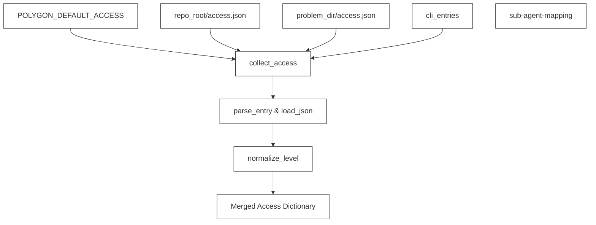
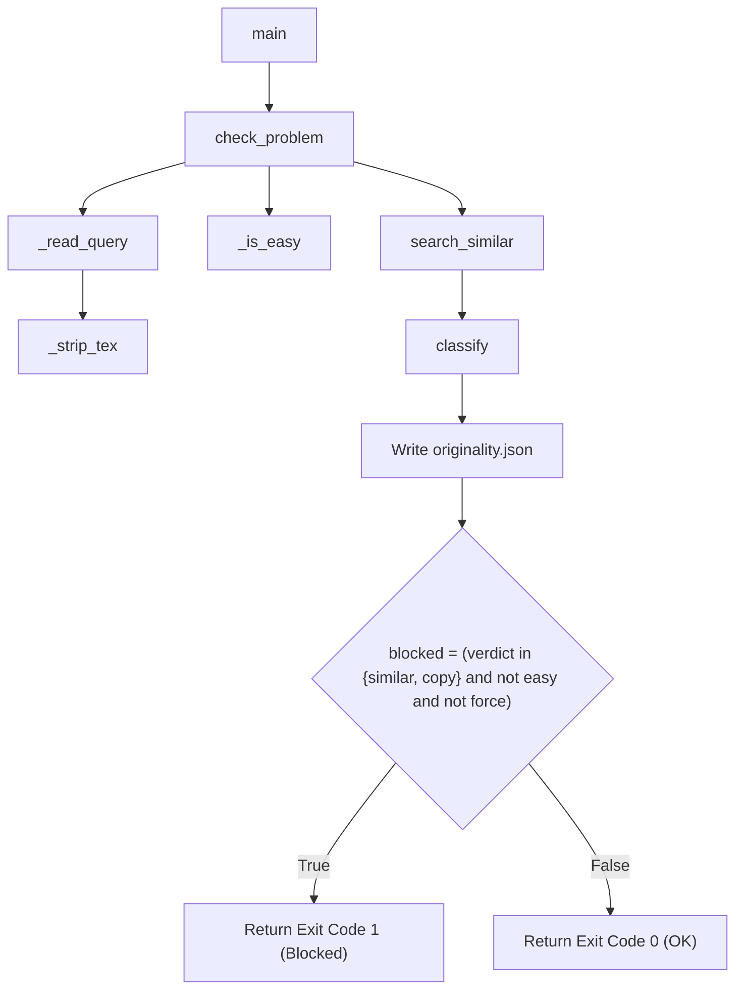

# Access Control & Originality Check

Relevant source files

The following files were used as context for generating this wiki page:
- [polyup/access.py](https://github.com/7oSkaaa/polygon-problems-generator/blob/main/polyup/access.py)
- [polyup/originality.py](https://github.com/7oSkaaa/polygon-problems-generator/blob/main/polyup/originality.py)

## Purpose and Scope
This page details the implementation of access permission management and originality verification within the `polyup` toolchain. Specifically, it covers `polyup/access.py`, which handles Polygon problem access rights merging and normalization [polyup/access.py:1-82](https://github.com/7oSkaaa/polygon-problems-generator/blob/main/polyup/access.py#L1-L82), and `polyup/originality.py`, which integrates with the `yuantiji.ac` similarity search API to prevent duplicate problem generation [polyup/originality.py:1-206](https://github.com/7oSkaaa/polygon-problems-generator/blob/main/polyup/originality.py#L1-L206).

---

## 1. Access Control Implementation (`polyup/access.py`)

The access control module parses, normalizes, and merges user permissions for Polygon problems across multiple configuration layers [polyup/access.py:1-82](https://github.com/7oSkaaa/polygon-problems-generator/blob/main/polyup/access.py#L1-L82). Polygon supports three access levels: `READ`, `WRITE`, and `NONE` (`VALID_ACCESS = {"READ", "WRITE", "NONE"}`) [polyup/access.py:9-9](https://github.com/7oSkaaa/polygon-problems-generator/blob/main/polyup/access.py#L9-L9).

### Key Functions and Validation Rules

* **`normalize_level(level: str)`**: Maps shorthand or variant access strings to canonical Polygon permissions [polyup/access.py:12-25](https://github.com/7oSkaaa/polygon-problems-generator/blob/main/polyup/access.py#L12-L25). Accepts `R`/`READ`, `W`/`WRITE`, and `N`/`NONE`/`REVOKE`/`REMOVE`. Explicitly rejects `OWNER` (since the Polygon API does not permit assigning ownership via `problem.setAccess`) [polyup/access.py:20-23](https://github.com/7oSkaaa/polygon-problems-generator/blob/main/polyup/access.py#L20-L23).
* **`parse_entry(entry: str)`**: Splits a `user:level` string (e.g., `alice:write`) [polyup/access.py:27-36](https://github.com/7oSkaaa/polygon-problems-generator/blob/main/polyup/access.py#L27-L36). Validates that the login is non-empty and does not use user-group syntax (`@`), which is unsupported by `problem.setAccess` [polyup/access.py:30-35](https://github.com/7oSkaaa/polygon-problems-generator/blob/main/polyup/access.py#L30-L35).
* **`parse_env(raw: str | None)`**: Parses comma-separated user-level pairs from the `POLYGON_DEFAULT_ACCESS` environment variable [polyup/access.py:39-49](https://github.com/7oSkaaa/polygon-problems-generator/blob/main/polyup/access.py#L39-L49).
* **`load_json(path: Path)`**: Loads a JSON object mapping user logins to access levels from `access.json` files, validating against group syntax and normalizing each level [polyup/access.py:52-66](https://github.com/7oSkaaa/polygon-problems-generator/blob/main/polyup/access.py#L52-L66).
* **`collect_access(repo_root, problem_dir, cli_entries)`**: Merges access configurations across hierarchy levels with later entries overriding earlier ones [polyup/access.py:69-82](https://github.com/7oSkaaa/polygon-problems-generator/blob/main/polyup/access.py#L69-L82):
  1. Environment variable (`POLYGON_DEFAULT_ACCESS`) [polyup/access.py:76-76](https://github.com/7oSkaaa/polygon-problems-generator/blob/main/polyup/access.py#L76-L76)
  2. Repository-level `access.json` (`repo_root / "access.json"`) [polyup/access.py:77-77](https://github.com/7oSkaaa/polygon-problems-generator/blob/main/polyup/access.py#L77-L77)
  3. Problem-level `access.json` (`problem_dir / "access.json"`) [polyup/access.py:78-78](https://github.com/7oSkaaa/polygon-problems-generator/blob/main/polyup/access.py#L78-L78)
  4. Command-line interface entries (`cli_entries`) [polyup/access.py:79-81](https://github.com/7oSkaaa/polygon-problems-generator/blob/main/polyup/access.py#L79-L81)

### Diagram: Access Control Merge Flow

*Sources: [polyup/access.py:1-82](https://github.com/7oSkaaa/polygon-problems-generator/blob/main/polyup/access.py#L1-L82)*

---

## 2. Originality Check Gate (`polyup/originality.py`)

The originality module queries `yuantiji.ac` to ensure that generated problems are distinct from existing competitive programming problems [polyup/originality.py:1-166](https://github.com/7oSkaaa/polygon-problems-generator/blob/main/polyup/originality.py#L1-L166).

### Thresholds and Configuration
* **`YUANTIJI_URL`**: Defaults to `https://yuantiji.ac/api/search` (overridable via `YUANTIJI_URL`) [polyup/originality.py:18-18](https://github.com/7oSkaaa/polygon-problems-generator/blob/main/polyup/originality.py#L18-L18).
* **`COPY_THRESHOLD`**: Cosine similarity `>= 0.90` is classified as a copy (`copy`) [polyup/originality.py:19-19, 93-94]().
* **`SIMILAR_THRESHOLD`**: Cosine similarity `>= 0.85` is classified as similar (`similar`) [polyup/originality.py:20-20, 95-96]().
* **`EASY_LEVELS`**: Problems categorized as `ace`, `div2-a`, or similar are flagged as easy and are reported but never blocked [polyup/originality.py:21-28, 52-65, 112-112]().

### Processing Pipeline

1. **Query Extraction (`_read_query`)**: Reads either `statement/statement.tex` or `statement/raw.tex` from the problem directory [polyup/originality.py:40-50](https://github.com/7oSkaaa/polygon-problems-generator/blob/main/polyup/originality.py#L40-L50).
2. **LaTeX Stripping (`_strip_tex`)**: Removes comments (`%`), environment tags (`\begin`, `\end`), inline math delimiters (`$`), and generic LaTeX commands to isolate plain text [polyup/originality.py:31-37](https://github.com/7oSkaaa/polygon-problems-generator/blob/main/polyup/originality.py#L31-L37).
3. **Easy Problem Check (`_is_easy`)**: Scans `difficulty.txt` and `tags.txt` for tokens matching `ace` or `div2-a` [polyup/originality.py:52-65](https://github.com/7oSkaaa/polygon-problems-generator/blob/main/polyup/originality.py#L52-L65).
4. **Remote Search (`search_similar`)**: Sends a POST request to `YUANTIJI_URL` with truncated text (`max 15,000` chars), query limit `k=8`, and LLM `rewrite=True` [polyup/originality.py:68-84](https://github.com/7oSkaaa/polygon-problems-generator/blob/main/polyup/originality.py#L68-L84).
5. **Classification (`classify`)**: Evaluates top match cosine similarity (`cos`) against thresholds to return `ok`, `similar`, or `copy` [polyup/originality.py:87-97](https://github.com/7oSkaaa/polygon-problems-generator/blob/main/polyup/originality.py#L87-L97).
6. **Blocking Gate (`check_problem`)**: Writes an `originality.json` report into the problem directory [polyup/originality.py:126-129](https://github.com/7oSkaaa/polygon-problems-generator/blob/main/polyup/originality.py#L126-L129). Blocks execution (`blocked = True`) if the verdict is `similar` or `copy`, unless the problem is easy or `--force` is supplied [polyup/originality.py:112-112](https://github.com/7oSkaaa/polygon-problems-generator/blob/main/polyup/originality.py#L112-L112).

### Diagram: Originality Gate Execution

*Sources: [polyup/originality.py:1-206](https://github.com/7oSkaaa/polygon-problems-generator/blob/main/polyup/originality.py#L1-L206)*

---

## Summary of Code Entities

| Entity / Function | File Path | Role |
| :--- | :--- | :--- |
| `normalize_level` | `polyup/access.py` | Validates and standardizes permission levels (`READ`/`WRITE`/`NONE`) [polyup/access.py:12-25](https://github.com/7oSkaaa/polygon-problems-generator/blob/main/polyup/access.py#L12-L25) |
| `parse_entry` | `polyup/access.py` | Parses `user:level` strings and rejects group entries [polyup/access.py:27-36](https://github.com/7oSkaaa/polygon-problems-generator/blob/main/polyup/access.py#L27-L36) |
| `collect_access` | `polyup/access.py` | Merges access configuration across environment, files, and CLI [polyup/access.py:69-82](https://github.com/7oSkaaa/polygon-problems-generator/blob/main/polyup/access.py#L69-L82) |
| `_strip_tex` | `polyup/originality.py` | Sanitizes LaTeX problem statements into plain text [polyup/originality.py:31-37](https://github.com/7oSkaaa/polygon-problems-generator/blob/main/polyup/originality.py#L31-L37) |
| `_is_easy` | `polyup/originality.py` | Checks problem metadata for difficulty exemptions (`Ace` / `Div2-A`) [polyup/originality.py:52-65](https://github.com/7oSkaaa/polygon-problems-generator/blob/main/polyup/originality.py#L52-L65) |
| `search_similar` | `polyup/originality.py` | Queries `yuantiji.ac` API for semantic similarity [polyup/originality.py:68-84](https://github.com/7oSkaaa/polygon-problems-generator/blob/main/polyup/originality.py#L68-L84) |
| `check_problem` | `polyup/originality.py` | Coordinates search, classification, report generation, and blocking [polyup/originality.py:100-132](https://github.com/7oSkaaa/polygon-problems-generator/blob/main/polyup/originality.py#L100-L132) |

*Sources: [polyup/access.py:1-82](https://github.com/7oSkaaa/polygon-problems-generator/blob/main/polyup/access.py#L1-L82), [polyup/originality.py:1-206](https://github.com/7oSkaaa/polygon-problems-generator/blob/main/polyup/originality.py#L1-L206)*
