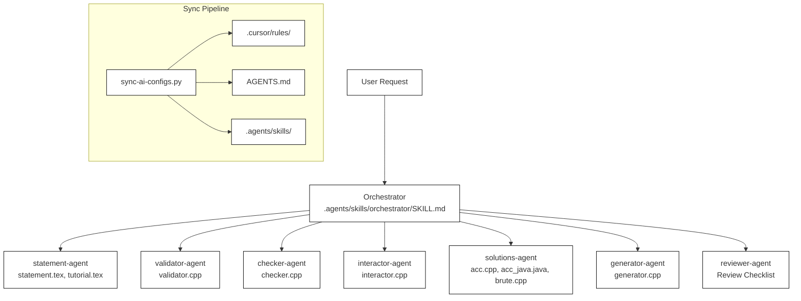
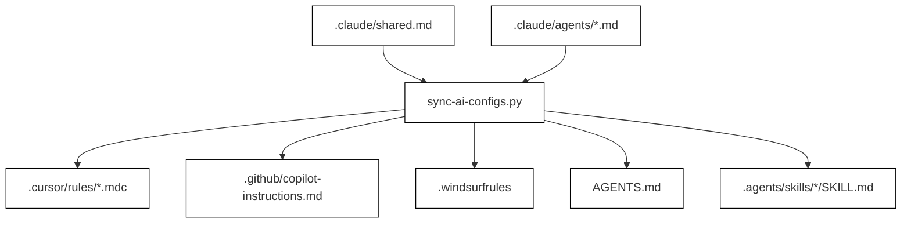

# Agent System

Relevant source files

The following files were used as context for generating this wiki page:
- [.agents/skills/orchestrator/SKILL.md](https://github.com/7oSkaaa/polygon-problems-generator/blob/main/.agents/skills/orchestrator/SKILL.md)
- [.claude/agents/orchestrator.md](https://github.com/7oSkaaa/polygon-problems-generator/blob/main/.claude/agents/orchestrator.md)
- [.claude/shared.md](https://github.com/7oSkaaa/polygon-problems-generator/blob/main/.claude/shared.md)
- [AGENTS.md](https://github.com/7oSkaaa/polygon-problems-generator/blob/main/AGENTS.md)
- [sync-ai-configs.py](https://github.com/7oSkaaa/polygon-problems-generator/blob/main/sync-ai-configs.py)

## Purpose and Scope

This parent page provides a high-level overview of the multi-agent architecture implemented in `polygon-problems-generator`. The system relies on a centralized source of truth (`.claude/shared.md`) [AGENTS.md:3-5](https://github.com/7oSkaaa/polygon-problems-generator/blob/main/AGENTS.md#L3-L5) and an orchestrator-driven sub-agent roster to automate the creation, verification, and maintenance of competitive programming problems. 

For granular technical specifications, rule sets, and implementation details, refer to the child sections linked below.

Sources: [AGENTS.md:1-16](https://github.com/7oSkaaa/polygon-problems-generator/blob/main/AGENTS.md#L1-L16), [.claude/shared.md:1-14](https://github.com/7oSkaaa/polygon-problems-generator/blob/main/.claude/shared.md#L1-L14)

---

## Agent Architecture and Roster

The agent system consists of a primary orchestrator that coordinates specialized sub-agents. Each sub-agent is responsible for a distinct component of the problem generation pipeline, operating under strict constraints defined in shared configurations and individual role contracts.

*Diagram 1: Orchestrator Pipeline and Sub-Agent Roster Mapping*

Sources: [AGENTS.md:18-30](https://github.com/7oSkaaa/polygon-problems-generator/blob/main/AGENTS.md#L18-L30), [.agents/skills/orchestrator/SKILL.md:10-27](https://github.com/7oSkaaa/polygon-problems-generator/blob/main/.agents/skills/orchestrator/SKILL.md#L10-L27)

---

### 2.1. Orchestrator and Slash Commands

The orchestrator manages the problem folder lifecycle, coordinating execution sequence and handling remediation via `/fix-component` when validation or verification fails. It processes parameters such as `multitest` and `interactive` flags and passes them down to sub-agent invocations.

For details, see [Orchestrator and Slash Commands](Orchestrator-and-Slash-Commands).

Sources: [.agents/skills/orchestrator/SKILL.md:3-27](https://github.com/7oSkaaa/polygon-problems-generator/blob/main/.agents/skills/orchestrator/SKILL.md#L3-L27), [.claude/agents/orchestrator.md:3-26](https://github.com/7oSkaaa/polygon-problems-generator/blob/main/.claude/agents/orchestrator.md#L3-L26)

---

### 2.2. Statement & Tutorial Agent

The `statement-agent` drafts competitive programming problem statements and editorial tutorials adhering to strict LaTeX formatting rules. It enforces concise problem descriptions, clear legends, and hidden algorithmic cores while utilizing human-readable English styling.

For details, see [Statement & Tutorial Agent](Statement-and-Tutorial-Agent).

Sources: [AGENTS.md:20-22](https://github.com/7oSkaaa/polygon-problems-generator/blob/main/AGENTS.md#L20-L22), [.claude/shared.md:97-99](https://github.com/7oSkaaa/polygon-problems-generator/blob/main/.claude/shared.md#L97-L99)

---

### 2.3. Validator, Checker & Generator Agents

This group of agents handles input validation, output verification, and test case generation. The `validator-agent` writes `validator.cpp` using `testlib.h`, the `checker-agent` recommends standard checkers or implements custom verification logic in `checker.cpp`, and the `generator-agent` constructs robust input generators.

For details, see [Validator, Checker & Generator Agents](Validator-Checker-and-Generator-Agents).

Sources: [AGENTS.md:21-27](https://github.com/7oSkaaa/polygon-problems-generator/blob/main/AGENTS.md#L21-L27), [AGENTS.md:115-155](https://github.com/7oSkaaa/polygon-problems-generator/blob/main/AGENTS.md#L115-L155)

---

### 2.4. Solutions Agent

The `solutions-agent` implements reference solutions across required complexity tiers and languages. It produces standard main solutions (`acc.cpp`, `acc_java.java`), alternative approaches (`acc_alt.cpp`), brute-force reference solutions (`brute.cpp`), and incorrect solutions (`wa.cpp`) adhering to strict language templates and banned construct rules.

For details, see [Solutions Agent](Solutions-Agent).

Sources: [AGENTS.md:24](https://github.com/7oSkaaa/polygon-problems-generator/blob/main/AGENTS.md#L24), [AGENTS.md:38-45](https://github.com/7oSkaaa/polygon-problems-generator/blob/main/AGENTS.md#L38-L45)

---

### 2.5. Reviewer Agent

The `reviewer-agent` executes a comprehensive review checklist across all generated problem components. It enforces strict blocking verdicts on any verification failure, triggering targeted component regeneration before package compilation and synchronization.

For details, see [Reviewer Agent](Reviewer-Agent).

Sources: [AGENTS.md:28](https://github.com/7oSkaaa/polygon-problems-generator/blob/main/AGENTS.md#L28), [AGENTS.md:78](https://github.com/7oSkaaa/polygon-problems-generator/blob/main/AGENTS.md#L78)

---

### 2.6. Multi-Tool Config Sync

The configuration synchronization utility (`sync-ai-configs.py`) maintains consistency across multiple AI integration environments. It reads the centralized shared rules from `.claude/shared.md` and generates corresponding configuration files for Cursor rules, GitHub Copilot, Windsurf, `AGENTS.md`, and agent skills.

*Diagram 2: Multi-Tool Configuration Synchronization Flow*

For details, see [Multi-Tool Config Sync](Multi-Tool-Config-Sync).

Sources: [sync-ai-configs.py:1-178](https://github.com/7oSkaaa/polygon-problems-generator/blob/main/sync-ai-configs.py#L1-L178), [AGENTS.md:1-8](https://github.com/7oSkaaa/polygon-problems-generator/blob/main/AGENTS.md#L1-L8)
