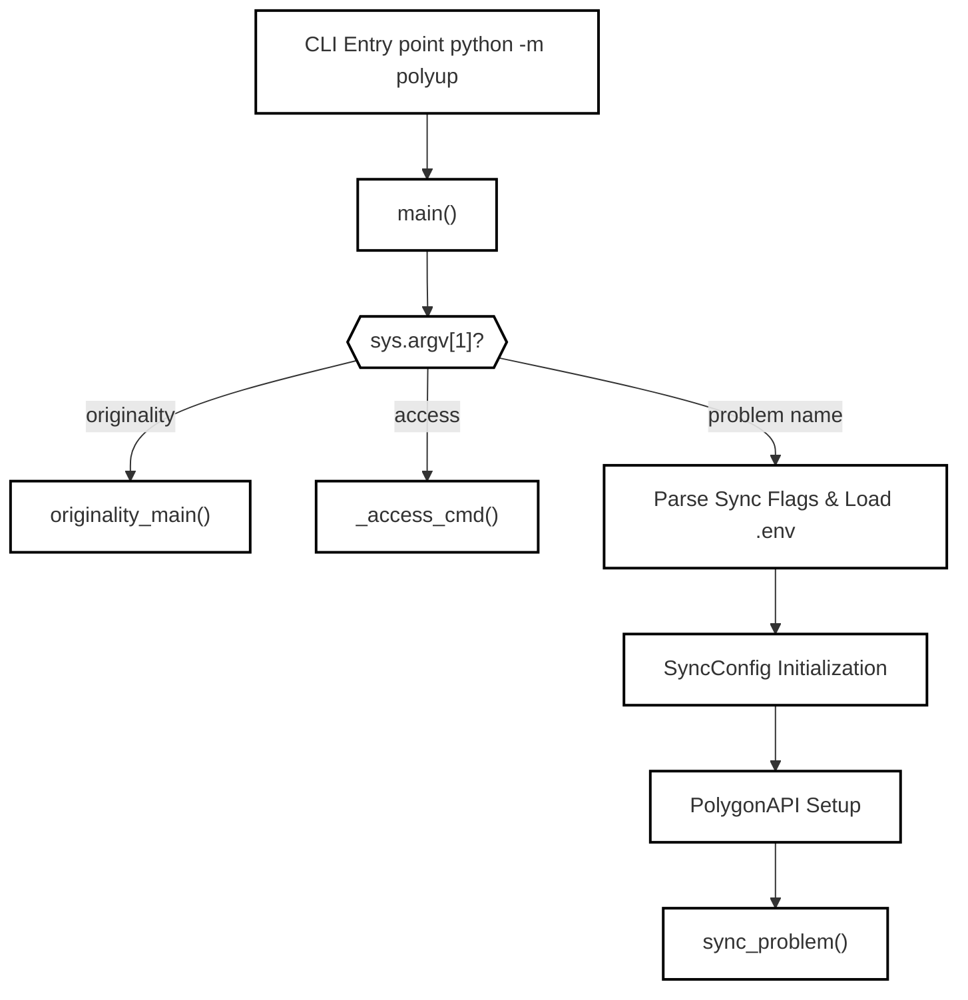
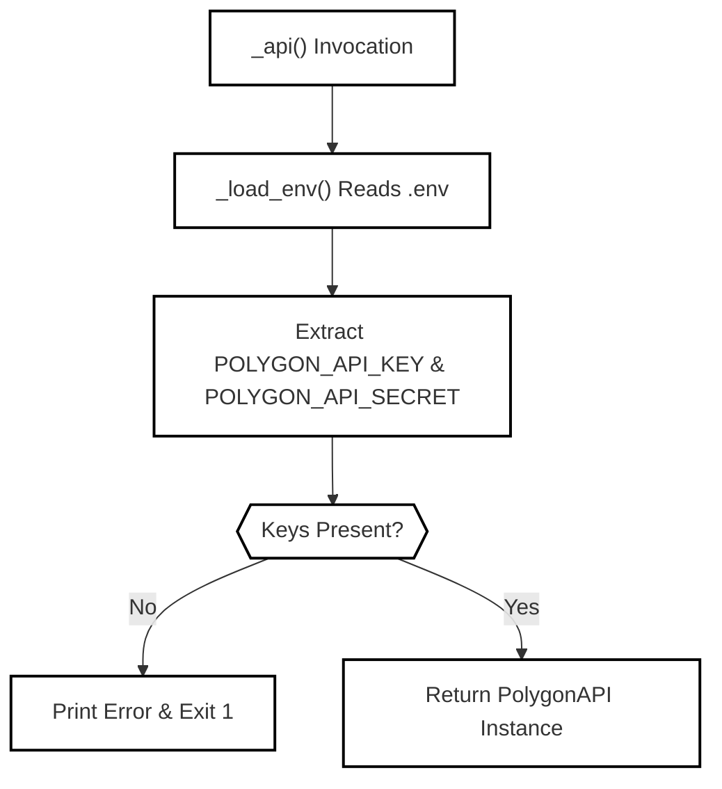

# CLI and Configuration

Relevant source files

The following files were used as context for generating this wiki page:
- [polyup/__main__.py](https://github.com/7oSkaaa/polygon-problems-generator/blob/main/polyup/__main__.py)
- [polyup/config.py](https://github.com/7oSkaaa/polygon-problems-generator/blob/main/polyup/config.py)

## Purpose and Scope

This page documents the command-line interface (CLI) entry point and configuration system of the `polyup` toolchain (`polyup/__main__.py` and `polyup/config.py`). It explains command-line flags, subcommand routing (`originality` and `access`), environment variable parsing (`.env`), API credential validation, and configuration defaults encapsulated in `SyncConfig`.

---

## CLI Entry Point and Argument Parsing (`__main__.py`)

The CLI is invoked via Python's module execution flag: `python -m polyup <problem>` [polyup/__main__.py:1](https://github.com/7oSkaaa/polygon-problems-generator/blob/main/polyup/__main__.py#L1) or via subcommands like `originality` and `access` [polyup/__main__.py:90-95](https://github.com/7oSkaaa/polygon-problems-generator/blob/main/polyup/__main__.py#L90-L95). 

The execution flow begins in `main()`, which intercepts top-level subcommand requests before falling back to the standard problem synchronization pipeline [polyup/__main__.py:89-145](https://github.com/7oSkaaa/polygon-problems-generator/blob/main/polyup/__main__.py#L89-L145).

### Subcommands and Flags
- **`originality`**: Delegates execution to the originality checker module via `originality_main()` [polyup/__main__.py:90-93](https://github.com/7oSkaaa/polygon-problems-generator/blob/main/polyup/__main__.py#L90-L93).
- **`access`**: Invokes `_access_cmd()` [polyup/__main__.py:94-95](https://github.com/7oSkaaa/polygon-problems-generator/blob/main/polyup/__main__.py#L94-L95), which sets up an argument parser supporting `--list` to view current permissions and `--access USER:LEVEL` to grant or revoke direct access [polyup/__main__.py:56-70](https://github.com/7oSkaaa/polygon-problems-generator/blob/main/polyup/__main__.py#L56-L70).
- **Default Sync Command**: Accepts problem folder names under `problems/` and configures parameters such as `--dry-run`, `--time-limit`, `--memory-limit`, `--lang`, `--no-build`, `--no-verify`, `--commit-message`, `--api-delay`, and `--access` [polyup/__main__.py:97-116](https://github.com/7oSkaaa/polygon-problems-generator/blob/main/polyup/__main__.py#L97-L116).

*Sources:* `polyup/__main__.py:56-145]()`

---

## Environment Variable and Credential Management

Before interacting with the Polygon API or validating problem directories, `polyup` loads configuration secrets from a local `.env` file situated at the repository root [polyup/__main__.py:15-32](https://github.com/7oSkaaa/polygon-problems-generator/blob/main/polyup/__main__.py#L15-L32).

### Environment Loading (`_load_env`)
The function `_load_env(env_file: Path)` reads line-by-line, stripping whitespace and comments (`#`), and parses `KEY=VALUE` pairs into `os.environ` using `os.environ.setdefault()` [polyup/__main__.py:15-23](https://github.com/7oSkaaa/polygon-problems-generator/blob/main/polyup/__main__.py#L15-L23).

### API Credential Validation (`_api`)
The `_api()` helper calls `_load_env()` on `repo_root / ".env"` and retrieves `POLYGON_API_KEY` and `POLYGON_API_SECRET` [polyup/__main__.py:25-28](https://github.com/7oSkaaa/polygon-problems-generator/blob/main/polyup/__main__.py#L25-L28). If either variable is missing, an error message is printed to `stderr` and the process terminates with exit code `1` [polyup/__main__.py:29-31](https://github.com/7oSkaaa/polygon-problems-generator/blob/main/polyup/__main__.py#L29-L31). Otherwise, it instantiates and returns a `PolygonAPI` instance configured with the specified API delay [polyup/__main__.py:32](https://github.com/7oSkaaa/polygon-problems-generator/blob/main/polyup/__main__.py#L32).

*Sources:* `polyup/__main__.py:15-32]()`

---

## Configuration Schema and Mapping Constants (`config.py`)

The `polyup/config.py` module defines core mappings and the `SyncConfig` dataclass, which controls packaging, verification rules, and solution mapping parameters [polyup/config.py:1-40](https://github.com/7oSkaaa/polygon-problems-generator/blob/main/polyup/config.py#L1-L40).

### Key Constants
- **`SOLUTION_TAGS`**: Maps solution convention filenames/tags to Polygon verdict types [polyup/config.py:6-12](https://github.com/7oSkaaa/polygon-problems-generator/blob/main/polyup/config.py#L6-L12):
  - `"acc"` $\rightarrow$ `"MA"` [polyup/config.py:7](https://github.com/7oSkaaa/polygon-problems-generator/blob/main/polyup/config.py#L7)
  - `"acc_java"` $\rightarrow$ `"OK"` [polyup/config.py:8](https://github.com/7oSkaaa/polygon-problems-generator/blob/main/polyup/config.py#L8)
  - `"acc_alt"` $\rightarrow$ `"OK"` [polyup/config.py:9](https://github.com/7oSkaaa/polygon-problems-generator/blob/main/polyup/config.py#L9)
  - `"brute"` $\rightarrow$ `"TL"` [polyup/config.py:10](https://github.com/7oSkaaa/polygon-problems-generator/blob/main/polyup/config.py#L10)
  - `"wa"` $\rightarrow$ `"WA"` [polyup/config.py:11](https://github.com/7oSkaaa/polygon-problems-generator/blob/main/polyup/config.py#L11)
- **`SOURCE_TYPES`**: Maps source file extensions to Polygon compiler specifiers [polyup/config.py:14-17](https://github.com/7oSkaaa/polygon-problems-generator/blob/main/polyup/config.py#L14-L17):
  - `".cpp"` $\rightarrow$ `"cpp.g++17"` [polyup/config.py:15](https://github.com/7oSkaaa/polygon-problems-generator/blob/main/polyup/config.py#L15)
  - `".java"` $\rightarrow$ `"java21"` [polyup/config.py:16](https://github.com/7oSkaaa/polygon-problems-generator/blob/main/polyup/config.py#L16)
- **`STANDARD_CHECKERS`**: A set of standard testlib checker names (`wcmp`, `ncmp`, `nyesno`, `yesno`, `fcmp`, `hcmp`, `lcmp`, `rcmp4`, `rcmp6`, `rcmp9`) [polyup/config.py:19-22](https://github.com/7oSkaaa/polygon-problems-generator/blob/main/polyup/config.py#L19-L22).

### `SyncConfig` Dataclass
The `SyncConfig` dataclass encapsulates build and upload parameters [polyup/config.py:25-40](https://github.com/7oSkaaa/polygon-problems-generator/blob/main/polyup/config.py#L25-L40):

| Field | Type | Default Value | Description |
| :--- | :--- | :--- | :--- |
| `time_limit_ms` | `int` | `1000` | Problem time limit in milliseconds [polyup/config.py:27](https://github.com/7oSkaaa/polygon-problems-generator/blob/main/polyup/config.py#L27) |
| `memory_limit_mb` | `int` | `256` | Problem memory limit in megabytes [polyup/config.py:28](https://github.com/7oSkaaa/polygon-problems-generator/blob/main/polyup/config.py#L28) |
| `input_file` | `str` | `"stdin"` | Input stream specifier [polyup/config.py:29](https://github.com/7oSkaaa/polygon-problems-generator/blob/main/polyup/config.py#L29) |
| `output_file` | `str` | `"stdout"` | Output stream specifier [polyup/config.py:30](https://github.com/7oSkaaa/polygon-problems-generator/blob/main/polyup/config.py#L30) |
| `statement_lang` | `str` | `"english"` | Default statement language [polyup/config.py:31](https://github.com/7oSkaaa/polygon-problems-generator/blob/main/polyup/config.py#L31) |
| `commit_message` | `str` | `"polyup auto-upload"` | Polygon VCS commit message [polyup/config.py:32](https://github.com/7oSkaaa/polygon-problems-generator/blob/main/polyup/config.py#L32) |
| `api_delay` | `float` | `0.3` | Throttle delay between API requests [polyup/config.py:33](https://github.com/7oSkaaa/polygon-problems-generator/blob/main/polyup/config.py#L33) |
| `build_package` | `bool` | `True` | Flag to build problem package [polyup/config.py:34](https://github.com/7oSkaaa/polygon-problems-generator/blob/main/polyup/config.py#L34) |
| `verify_package` | `bool` | `True` | Flag to verify package integrity [polyup/config.py:35](https://github.com/7oSkaaa/polygon-problems-generator/blob/main/polyup/config.py#L35) |
| `solution_tags` | `dict[str, str]` | `SOLUTION_TAGS` | Solution tag mapping dictionary [polyup/config.py:36](https://github.com/7oSkaaa/polygon-problems-generator/blob/main/polyup/config.py#L36) |
| `source_types` | `dict[str, str]` | `SOURCE_TYPES` | Source file extension compilation mappings [polyup/config.py:37](https://github.com/7oSkaaa/polygon-problems-generator/blob/main/polyup/config.py#L37) |
| `access` | `dict[str, str]` | `{}` | User login to permission level mapping (`READ`, `WRITE`, `NONE`) [polyup/config.py:38-39](https://github.com/7oSkaaa/polygon-problems-generator/blob/main/polyup/config.py#L38-L39) |
| `grant_access` | `bool` | `True` | Flag whether to apply access grants via `problem.setAccess` [polyup/config.py:40](https://github.com/7oSkaaa/polygon-problems-generator/blob/main/polyup/config.py#L40) |

*Sources:* `polyup/config.py:1-40]()`
