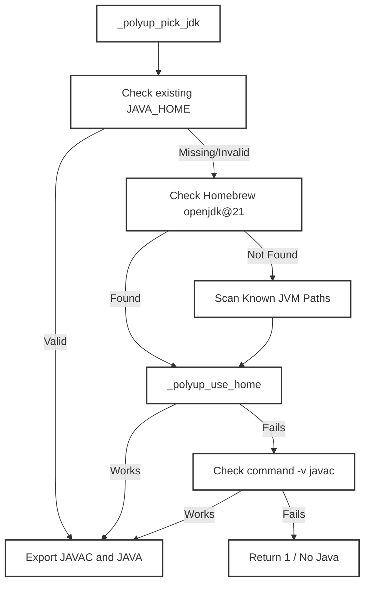
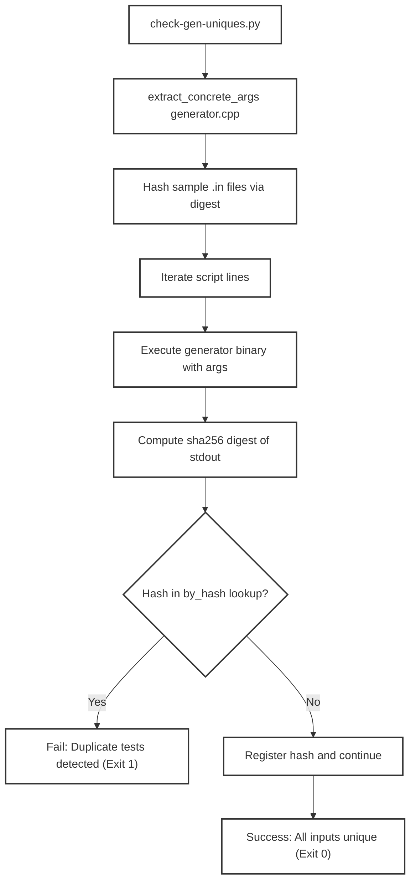
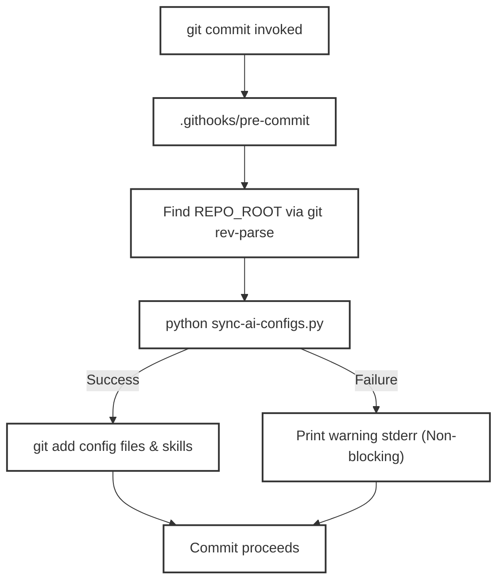
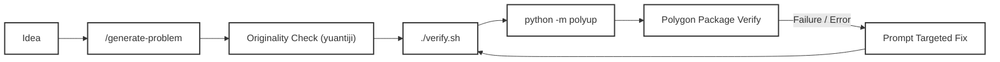

# Helper Scripts and Workflow Docs

Relevant source files

The following files were used as context for generating this wiki page:
- [.agents/skills/checker-agent/SKILL.md](https://github.com/7oSkaaa/polygon-problems-generator/blob/main/.agents/skills/checker-agent/SKILL.md)
- [.agents/skills/generator-agent/SKILL.md](https://github.com/7oSkaaa/polygon-problems-generator/blob/main/.agents/skills/generator-agent/SKILL.md)
- [.agents/skills/validator-agent/SKILL.md](https://github.com/7oSkaaa/polygon-problems-generator/blob/main/.agents/skills/validator-agent/SKILL.md)
- [.githooks/pre-commit](https://github.com/7oSkaaa/polygon-problems-generator/blob/main/.githooks/pre-commit)
- [docs/workflow.md](https://github.com/7oSkaaa/polygon-problems-generator/blob/main/docs/workflow.md)
- [scripts/check-gen-uniques.py](https://github.com/7oSkaaa/polygon-problems-generator/blob/main/scripts/check-gen-uniques.py)
- [scripts/java-env.sh](https://github.com/7oSkaaa/polygon-problems-generator/blob/main/scripts/java-env.sh)
- [scripts/setup-deps.sh](https://github.com/7oSkaaa/polygon-problems-generator/blob/main/scripts/setup-deps.sh)

## Purpose and Scope

This page documents the auxiliary tooling, environment setup scripts, uniqueness verification utilities, git hooks, and standard workflows provided in the repository. These components ensure that problem packages conform strictly to Polygon constraints, compile across supported toolchains (C++17 and Java 21), maintain synchronized AI assistant configurations, and follow a repeatable development lifecycle.

---

## 1. Environment Setup and Java Detection (`java-env.sh`, `setup-deps.sh`)

Because Polygon solutions and validators may run under various runtimes, local verification requires a reliable C++17 compiler and a fully functional JDK 21 (particularly for Java solutions). The repository provides robust environment resolution scripts.

### Java Environment Resolution (`java-env.sh`)

`scripts/java-env.sh` is designed to be sourced by other scripts (such as `verify.sh` and `setup-deps.sh`) to locate a real, functional JDK. On macOS, the default `/usr/bin/javac` is often a stub launcher that triggers an installation prompt rather than compiling code; `java-env.sh` explicitly rejects non-functional stubs.

*   `_polyup_javac_works()`: Validates that a candidate `javac` binary path exists, is executable, and successfully executes `-version` [scripts/java-env.sh:5-9](https://github.com/7oSkaaa/polygon-problems-generator/blob/main/scripts/java-env.sh#L5-L9).
*   `_polyup_use_home()`: Tests a candidate `JAVA_HOME` directory by checking `$home/bin/javac` with `_polyup_javac_works`. If successful, exports `JAVA_HOME`, `JAVAC`, and `JAVA` [scripts/java-env.sh:11-21](https://github.com/7oSkaaa/polygon-problems-generator/blob/main/scripts/java-env.sh#L11-L21).
*   `_polyup_pick_jdk()`: Iterates through search strategies in priority order:
    1. An already-set `JAVA_HOME` environment variable [scripts/java-env.sh:27-29](https://github.com/7oSkaaa/polygon-problems-generator/blob/main/scripts/java-env.sh#L27-L29).
    2. Homebrew-managed OpenJDK 21 paths (`openjdk@21` or `openjdk`) on macOS [scripts/java-env.sh:31-43](https://github.com/7oSkaaa/polygon-problems-generator/blob/main/scripts/java-env.sh#L31-L43).
    3. Common system paths on Linux and macOS (`/opt/homebrew/opt/openjdk@21`, `/usr/lib/jvm/java-21-openjdk`, `/usr/lib/jvm/temurin-21-jdk`, etc.) [scripts/java-env.sh:45-55](https://github.com/7oSkaaa/polygon-problems-generator/blob/main/scripts/java-env.sh#L45-L55).
    4. macOS system `/usr/libexec/java_home` utility [scripts/java-env.sh:57-62](https://github.com/7oSkaaa/polygon-problems-generator/blob/main/scripts/java-env.sh#L57-L62).
    5. Standard `javac` on the system `PATH` [scripts/java-env.sh:64-70](https://github.com/7oSkaaa/polygon-problems-generator/blob/main/scripts/java-env.sh#L64-L70).

*Sources: [scripts/java-env.sh:1-76](https://github.com/7oSkaaa/polygon-problems-generator/blob/main/scripts/java-env.sh#L1-L76)*

### Dependency Installer (`setup-deps.sh`)

`scripts/setup-deps.sh` verifies and installs local dependencies needed for test compilation and validation. It supports a check-only mode and automated package manager installation.

*   **Check Mode (`--check`)**: Evaluates whether `g++` and a working `javac` are available, printing their versions and exiting with status `1` if any dependencies are missing [scripts/setup-deps.sh:12-38](https://github.com/7oSkaaa/polygon-problems-generator/blob/main/scripts/setup-deps.sh#L12-L38).
*   **Automatic Installation**: 
    *   *macOS*: Requires Homebrew to install `openjdk@21` [scripts/setup-deps.sh:42-50](https://github.com/7oSkaaa/polygon-problems-generator/blob/main/scripts/setup-deps.sh#L42-L50) and prompts for Apple Command Line Tools (`xcode-select --install`) if `g++` is missing [scripts/setup-deps.sh:74-79](https://github.com/7oSkaaa/polygon-problems-generator/blob/main/scripts/setup-deps.sh#L74-L79).
    *   *Linux*: Automatically detects `apt-get` (`g++`, `openjdk-21-jdk`), `dnf` (`gcc-c++`, `java-21-openjdk-devel`), or `pacman` (`gcc`, `jdk21-openjdk`) [scripts/setup-deps.sh:52-71](https://github.com/7oSkaaa/polygon-problems-generator/blob/main/scripts/setup-deps.sh#L52-L71), [scripts/setup-deps.sh:80-92](https://github.com/7oSkaaa/polygon-problems-generator/blob/main/scripts/setup-deps.sh#L80-L92).

*Sources: [scripts/setup-deps.sh:1-121](https://github.com/7oSkaaa/polygon-problems-generator/blob/main/scripts/setup-deps.sh#L1-L121)*

---

## 2. Generator Uniqueness Checking (`scripts/check-gen-uniques.py`)

Polygon strictly rejects problem packages if two tests in any testset produce identical input files (raising the error: `Tests with indices X, Y in testset 'tests' are equal`). `scripts/check-gen-uniques.py` acts as a static and dynamic safeguard against duplicate inputs.

### Implementation and Data Flow

1. **FreeMarker Script Extraction**: `extract_concrete_args()` parses the generator C++ source file looking for FreeMarker script comment blocks [scripts/check-gen-uniques.py:15-23](https://github.com/7oSkaaa/polygon-problems-generator/blob/main/scripts/check-gen-uniques.py#L15-L23). It filters out comment lines, empty lines, and non-concrete lines, extracting command-line arguments for each test generation line [scripts/check-gen-uniques.py:26-44](https://github.com/7oSkaaa/polygon-problems-generator/blob/main/scripts/check-gen-uniques.py#L26-L44). It also enforces that duplicate command strings do not appear within the script block [scripts/check-gen-uniques.py:39-43](https://github.com/7oSkaaa/polygon-problems-generator/blob/main/scripts/check-gen-uniques.py#L39-L43).
2. **Sample Hashing**: If a sample directory (`samples/`) is provided, every `.in` file is read, hashed using SHA-256 via `digest()`, and registered in a global lookup table [scripts/check-gen-uniques.py:48-49](https://github.com/7oSkaaa/polygon-problems-generator/blob/main/scripts/check-gen-uniques.py#L48-L49), [scripts/check-gen-uniques.py:62-69](https://github.com/7oSkaaa/polygon-problems-generator/blob/main/scripts/check-gen-uniques.py#L62-L69).
3. **Generator Execution and Collision Detection**: The compiled generator binary is executed with the parameters extracted from each script line [scripts/check-gen-uniques.py:78-83](https://github.com/7oSkaaa/polygon-problems-generator/blob/main/scripts/check-gen-uniques.py#L78-L83). The standard output is hashed via SHA-256 [scripts/check-gen-uniques.py:89](https://github.com/7oSkaaa/polygon-problems-generator/blob/main/scripts/check-gen-uniques.py#L89). If the hash already exists in `by_hash`, the script prints a duplication error and exits with code `1` [scripts/check-gen-uniques.py:91-97](https://github.com/7oSkaaa/polygon-problems-generator/blob/main/scripts/check-gen-uniques.py#L91-L97).

*Sources: [scripts/check-gen-uniques.py:1-104](https://github.com/7oSkaaa/polygon-problems-generator/blob/main/scripts/check-gen-uniques.py#L1-L104)*

---

## 3. Pre-Commit Automation and Configuration Sync (`.githooks/pre-commit`)

To keep multi-tool AI configuration files (`.cursor/rules`, `.github/copilot-instructions.md`, `AGENTS.md`, `.windsurfrules`, `.agents/skills/`) synchronized with the source-of-truth files in `.claude/`, the repository employs a Git pre-commit hook.

### Pre-Commit Execution Flow

When a developer runs `git commit`, `.githooks/pre-commit` executes the following steps:

1. Resolves the repository root path using `git rev-parse --show-toplevel` [.githooks/pre-commit:5](https://github.com/7oSkaaa/polygon-problems-generator/blob/main/.githooks/pre-commit#L5).
2. Executes `python sync-ai-configs.py` to regenerate all derived AI instruction files [.githooks/pre-commit:7](https://github.com/7oSkaaa/polygon-problems-generator/blob/main/.githooks/pre-commit#L7). If the synchronization script fails, it issues a warning and allows the commit to proceed without failing [.githooks/pre-commit:8-10](https://github.com/7oSkaaa/polygon-problems-generator/blob/main/.githooks/pre-commit#L8-L10).
3. Automatically stages the updated configuration directories and files using `git add` [.githooks/pre-commit:12-17](https://github.com/7oSkaaa/polygon-problems-generator/blob/main/.githooks/pre-commit#L12-L17).

*Sources: [.githooks/pre-commit:1-17](https://github.com/7oSkaaa/polygon-problems-generator/blob/main/.githooks/pre-commit#L1-L17)*

---

## 4. Problem Development Workflow and Troubleshooting (`docs/workflow.md`)

`docs/workflow.md` outlines the end-to-end problem creation and verification lifecycle, distinguishing between local verification harness checks and Polygon server-side validations.

### The Development Lifecycle

The intended workflow follows a strict linear path with targeted feedback loops:

*Sources: [docs/workflow.md:7-11](https://github.com/7oSkaaa/polygon-problems-generator/blob/main/docs/workflow.md#L7-L11)*

### Verification Tiers Comparison

| Tool | What it is | Scope & Limitations |
| :--- | :--- | :--- |
| **`./verify.sh`** | Lightweight pre-upload harness [docs/workflow.md:66](https://github.com/7oSkaaa/polygon-problems-generator/blob/main/docs/workflow.md#L66) | Compiles sources with `-Wall -Wextra -Werror`, runs validator tests, samples, cross-checks solutions, and stresses `acc` vs `brute`. Does *not* execute Polygon FreeMarker scripts or replace full server invocations [docs/workflow.md:66](https://github.com/7oSkaaa/polygon-problems-generator/blob/main/docs/workflow.md#L66). |
| **Polyman** | Local Polygon-like environment [docs/workflow.md:67](https://github.com/7oSkaaa/polygon-problems-generator/blob/main/docs/workflow.md#L67) | Pulls problems, runs tests via Polygon rules, and executes local invocations. Useful for a full local clone of Polygon's runner [docs/workflow.md:67](https://github.com/7oSkaaa/polygon-problems-generator/blob/main/docs/workflow.md#L67). |
| **`python -m polyup`** | Official upload toolchain [docs/workflow.md:68](https://github.com/7oSkaaa/polygon-problems-generator/blob/main/docs/workflow.md#L68) | Uploads the problem folder to Polygon and triggers package building with `verify=true` on the server [docs/workflow.md:68](https://github.com/7oSkaaa/polygon-problems-generator/blob/main/docs/workflow.md#L68). |

*Sources: [docs/workflow.md:62-70](https://github.com/7oSkaaa/polygon-problems-generator/blob/main/docs/workflow.md#L62-L70)*

### Targeted Remediation Guidelines

When local verification or Polygon raises an error, developers are instructed **not** to regenerate the entire problem, but to target the specific component:
* **Local Verification Failures**: Pass the specific file (e.g., `solutions/acc.cpp`) and the failing section log to the corresponding sub-agent [docs/workflow.md:25-32](https://github.com/7oSkaaa/polygon-problems-generator/blob/main/docs/workflow.md#L25-L32).
* **Polygon Warnings/Invocations**: Fix validator or generator files specifically using the invocation log [docs/workflow.md:34-41](https://github.com/7oSkaaa/polygon-problems-generator/blob/main/docs/workflow.md#L34-L41).
* **Originality Blocks**: If `yuantiji.ac` flags a problem as a copy or near-duplicate (cosine similarity $\ge 0.90$ for copies, $\ge 0.85$ for similar problems), propose an entirely new task with equivalent difficulty [docs/workflow.md:51-56](https://github.com/7oSkaaa/polygon-problems-generator/blob/main/docs/workflow.md#L51-L56), [docs/workflow.md:72-80](https://github.com/7oSkaaa/polygon-problems-generator/blob/main/docs/workflow.md#L72-L80).

*Sources: [docs/workflow.md:1-80](https://github.com/7oSkaaa/polygon-problems-generator/blob/main/docs/workflow.md#L1-L80)*
