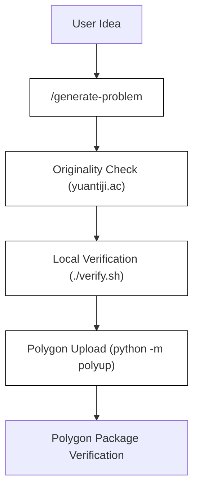
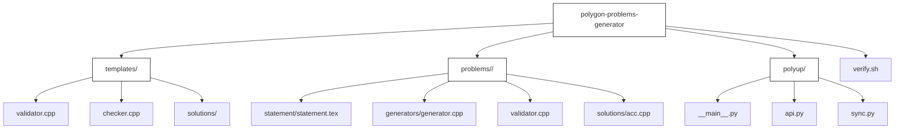

# Overview

Relevant source files

The following files were used as context for generating this wiki page:
- [LICENSE](https://github.com/7oSkaaa/polygon-problems-generator/blob/main/LICENSE)
- [README.md](https://github.com/7oSkaaa/polygon-problems-generator/blob/main/README.md)
- [guidelines.md](https://github.com/7oSkaaa/polygon-problems-generator/blob/main/guidelines.md)

The **Polygon Problems Generator** is an automated framework designed to generate complete, Codeforces Polygon-ready competitive programming problems using AI agents [[README.md:1-5](https://github.com/7oSkaaa/polygon-problems-generator/blob/main/README.md#L1-L5)]. The system handles the entire lifecycle of a problem—from initial idea generation, statement writing, and solution drafting to validation, stress-testing, local verification, and automated package uploading via `polyup` [[README.md:1-5](https://github.com/7oSkaaa/polygon-problems-generator/blob/main/README.md#L1-L5), [guidelines.md:15-24](https://github.com/7oSkaaa/polygon-problems-generator/blob/main/guidelines.md#L15-L24)].

---

## End-to-End Flow: From Idea to Polygon Package

The problem creation workflow follows a strict, repeatable pipeline coordinated by an orchestrator agent and specialized sub-agents [[README.md:10-13](https://github.com/7oSkaaa/polygon-problems-generator/blob/main/README.md#L10-L13), [guidelines.md:15-24](https://github.com/7oSkaaa/polygon-problems-generator/blob/main/guidelines.md#L15-L24)]. 

*Figure 1: End-to-end problem generation and verification pipeline.*

1. **Generation**: The user invokes `/generate-problem` with basic problem parameters (name, statement summary, constraints, multitest configuration) [[README.md:52-80](https://github.com/7oSkaaa/polygon-problems-generator/blob/main/README.md#L52-L80)].
2. **Originality Gate**: The problem statement and properties are checked against [yuantiji.ac](http://yuantiji.ac/en/) to prevent near-duplicates or unauthorized copies [[README.md:16-16](https://github.com/7oSkaaa/polygon-problems-generator/blob/main/README.md#L16-L16), [README.md:163-170](https://github.com/7oSkaaa/polygon-problems-generator/blob/main/README.md#L163-L170)].
3. **Local Harness Verification**: `./verify.sh` compiles solutions with `-Werror`, runs validator unit tests, tests sample files, executes correct (`acc.cpp`, `acc_java.java`, `acc_alt.cpp`), brute-force (`brute.cpp`), and wrong-answer (`wa.cpp`) solutions, and performs stress testing [[README.md:17-17](https://github.com/7oSkaaa/polygon-problems-generator/blob/main/README.md#L17-L17), [README.md:153-160](https://github.com/7oSkaaa/polygon-problems-generator/blob/main/README.md#L153-L160)].
4. **Polygon Packaging & Upload**: `python -m polyup <name>` bundles the generated problem assets into a Polygon-compatible package and uploads them via the Polygon API [[README.md:18-18](https://github.com/7oSkaaa/polygon-problems-generator/blob/main/README.md#L18-L18), [README.md:183-194](https://github.com/7oSkaaa/polygon-problems-generator/blob/main/README.md#L183-L194)].
5. **Remediation**: If verification or uploading fails, components can be targeted individually using `/fix-component` rather than regenerating the entire problem [[README.md:19-19](https://github.com/7oSkaaa/polygon-problems-generator/blob/main/README.md#L19-L19), [README.md:171-182](https://github.com/7oSkaaa/polygon-problems-generator/blob/main/README.md#L171-L182)].

Sources: `README.md:1-22`, `guidelines.md:13-37`

---

## Repository Layout and Entity Mapping

The codebase is organized around static base templates, active problem workspaces, AI agent definitions, and Python toolchain packages (`polyup`) [[guidelines.md:40-60](https://github.com/7oSkaaa/polygon-problems-generator/blob/main/guidelines.md#L40-L60)].

*Figure 2: Repository directory layout mapping natural folders to internal code structures.*

Sources: `guidelines.md:40-60`

---

## Child Pages

For comprehensive technical documentation on specific subsystems, refer to the following child pages:

- **[Getting Started & Configuration](Getting-Started-and-Configuration)** — Environment setup scripts (`scripts/setup-deps.sh`, `scripts/java-env.sh`), secret configurations (`.env` and `.env.example`), `.gitignore`, `.claude/settings.json`, and Git hooks.
- **[Problem Directory Layout](Problem-Directory-Layout)** — In-depth structure of `problems/<name>/` and `templates/`, detailing statement latex files, solution variants (`acc.cpp`, `acc_java.java`, `acc_alt.cpp`, `brute.cpp`, `wa.cpp`), generators, `validator.cpp`, `checker.cpp`, samples, and metadata files.

Sources: `README.md:23-49`, `guidelines.md:40-67`
