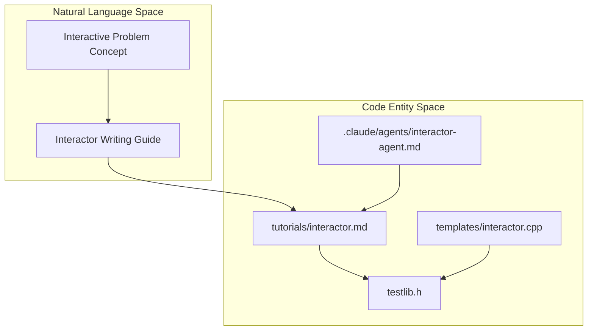
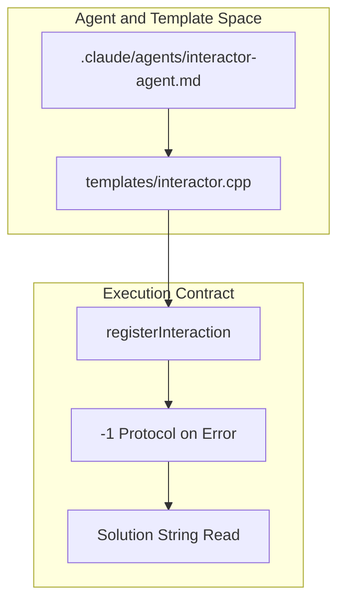

# Interactive Problems

Relevant source files

The following files were used as context for generating this wiki page:
- [.claude/agents/interactor-agent.md](https://github.com/7oSkaaa/polygon-problems-generator/blob/main/.claude/agents/interactor-agent.md)
- [templates/interactor.cpp](https://github.com/7oSkaaa/polygon-problems-generator/blob/main/templates/interactor.cpp)
- [tutorials/interactor.md](https://github.com/7oSkaaa/polygon-problems-generator/blob/main/tutorials/interactor.md)

This page provides a high-level overview of interactive problem support in the `polygon-problems-generator` repository. Interactive problems require active, real-time communication between a participant's solution and a judge-side interactor program rather than standard batch input/output processing.

For detailed technical references, implementation specifics, and deep dives, refer to the child pages:
- [Interactor Design with testlib](https://github.com/7oSkaaa/polygon-problems-generator/blob/main/Interactor-Design-with-testlib)
- [Interactor Agent Rules](https://github.com/7oSkaaa/polygon-problems-generator/blob/main/Interactor-Agent-Rules)

Sources: `tutorials/interactor.md:1-10()`, `.claude/agents/interactor-agent.md:1-17()`

---

## 3.1 Interactor Design with testlib

Interactive problems rely on `testlib.h` to manage the interactor process via `registerInteraction(argc, argv)` [tutorials/interactor.md:11-23()]. The interactor coordinates four distinct standard I/O streams (`inf`, `ouf`, `ans`, `cout`) to ingest test data, read participant queries, and emit responses [tutorials/interactor.md:25-36()].

Critical design patterns covered in the child page include:
* **Immediate Flushing**: Ensuring every response written to `cout` is explicitly flushed (`cout.flush()`) to prevent participant **ILE (Idleness Limit Exceeded)** errors [tutorials/interactor.md:37-47()].
* **Verdict Functions**: Issuing structured outcomes using `quitf(_ok, ...)`, `quitf(_wa, ...)`, `quitf(_pe, ...)`, and `quitf(_fail, ...)` for interactor/judge bugs [tutorials/interactor.md:48-58()].
* **Safe Parsing**: Utilizing bounded read methods like `ouf.readInt()` and `ouf.readToken()` to guard against malformed data [tutorials/interactor.md:59-70()].
* **Multi-test Management**: Forwarding the test count `t` and invoking `setTestCase(tc + 1)` for multi-test interactive sets [tutorials/interactor.md:137-158()].

For a complete breakdown of stream mechanics, query-count enforcement, and logging via `tout`, see [Interactor Design with testlib](Interactor-Design-with-testlib).

Sources: `tutorials/interactor.md:11-190()`

---

## 3.2 Interactor Agent Rules

The repository includes a dedicated sub-agent configuration (`interactor-agent`) responsible for generating compliant C++ interactors using standard templates [ .claude/agents/interactor-agent.md:1-6() ]. 

Key contractual constraints enforced by the agent include:
* **The `-1` Protocol**: On detecting query limit violations or malformed requests, the interactor must emit `-1` to the solution and flush *before* calling `quitf(_wa, ...)` [.claude/agents/interactor-agent.md:26-32()].
* **Solution-side Interop**: Requiring solutions to read responses as strings (`cin >> resp`) rather than raw characters, and banning `ios_base::sync_with_stdio(false), cin.tie(nullptr)` to preserve auto-flushing [.claude/agents/interactor-agent.md:33-40()].
* **Template Base**: Leveraging `templates/interactor.cpp` as the boilerplate foundation for interaction loops [templates/interactor.cpp:1-38()].

For detailed generation rules, code constraints, and validation requirements, see [Interactor Agent Rules](Interactor-Agent-Rules).

Sources: `.claude/agents/interactor-agent.md:1-65()`, `templates/interactor.cpp:1-38()`
