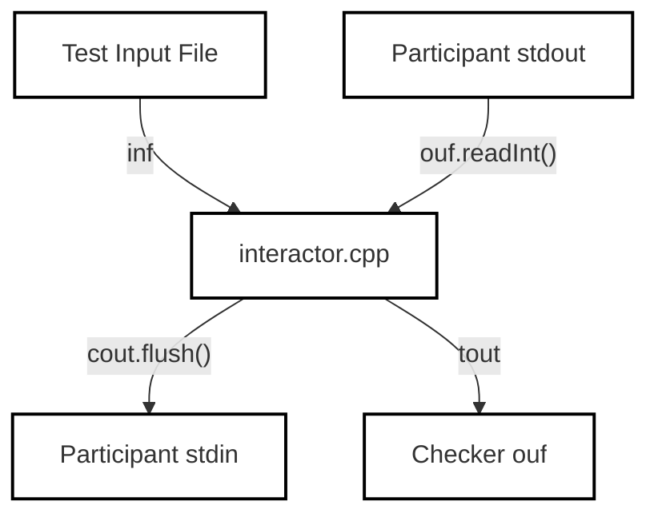

# Interactor Agent Rules

<details>
<summary>Relevant source files</summary>

The following files were used as context for generating this wiki page:
- [.agents/skills/interactor-agent/SKILL.md](https://github.com/7oSkaaa/polygon-problems-generator/blob/main/.agents/skills/interactor-agent/SKILL.md)
- [.claude/agents/interactor-agent.md](https://github.com/7oSkaaa/polygon-problems-generator/blob/main/.claude/agents/interactor-agent.md)

</details>


## Purpose and Scope
This page defines the agent-side generation contract and operational constraints for `interactor.cpp` within the Polygon Problems Generator pipeline. The Interactor Agent specializes in generating `testlib.h`-compliant interactors for interactive competitive programming problems, establishing bidirectional communication channels between the judge environment and the participant's solution [.agents/skills/interactor-agent/SKILL.md:1-11](https://github.com/7oSkaaa/polygon-problems-generator/blob/main/.agents/skills/interactor-agent/SKILL.md#L1-L11).

Sources: [.agents/skills/interactor-agent/SKILL.md:1-11](https://github.com/7oSkaaa/polygon-problems-generator/blob/main/.agents/skills/interactor-agent/SKILL.md#L1-L11), [.claude/agents/interactor-agent.md:1-10](https://github.com/7oSkaaa/polygon-problems-generator/blob/main/.claude/agents/interactor-agent.md#L1-L10)

---

## Interactor Architecture and Stream Mapping

An interactive problem relies on specific stream bindings provided by `testlib.h` to isolate the judge data from the participant's input and output channels. 

### Stream Reference Table

| Stream Entity | Source / Destination | Functional Role in `interactor.cpp` |
| :--- | :--- | :--- |
| `inf` | Test Input File | Reads secret test data, bounds, and structural parameters generated by generators [.agents/skills/interactor-agent/SKILL.md:46-46](https://github.com/7oSkaaa/polygon-problems-generator/blob/main/.agents/skills/interactor-agent/SKILL.md#L46-L46). |
| `ouf` | Participant Standard Output | Reads participant queries, intermediate guesses, and final answers [.agents/skills/interactor-agent/SKILL.md:47-47](https://github.com/7oSkaaa/polygon-problems-generator/blob/main/.agents/skills/interactor-agent/SKILL.md#L47-L47). |
| `cout` | Participant Standard Input | Transmits judge responses, hints, and error signals to the solution [.agents/skills/interactor-agent/SKILL.md:48-48](https://github.com/7oSkaaa/polygon-problems-generator/blob/main/.agents/skills/interactor-agent/SKILL.md#L48-L48). |
| `tout` | Interactor Diagnostic Output | Logs states readable by an optional checker (via checker's `ouf`) after an `_ok` verdict is issued [.agents/skills/interactor-agent/SKILL.md:49-49](https://github.com/7oSkaaa/polygon-problems-generator/blob/main/.agents/skills/interactor-agent/SKILL.md#L49-L49). |


*Figure 1: `interactor.cpp` stream interaction topology using `testlib.h` primitives.*

Sources: [.agents/skills/interactor-agent/SKILL.md:42-50](https://github.com/7oSkaaa/polygon-problems-generator/blob/main/.agents/skills/interactor-agent/SKILL.md#L42-L50)

---

## Core Generation Contract and Protocol Rules

The generated interactor must strictly adhere to `testlib.h` initialization and execution standards to prevent judge malfunctions, Idleness Limit Exceeded (ILE) errors, or undefined verdicts.

### Initialization and Mandatory Flushing
* **Initialization:** Every interactor must include `#include "testlib.h"` and call `registerInteraction(argc, argv)` without a third argument [.agents/skills/interactor-agent/SKILL.md:16-16](https://github.com/7oSkaaa/polygon-problems-generator/blob/main/.agents/skills/interactor-agent/SKILL.md#L16-L16).
* **Flushing:** Every write to `cout` must be immediately followed by `cout.flush()`. Forgetting to flush causes the participant's process to hang, resulting in an **ILE (Idleness Limit Exceeded)** verdict rather than a Wrong Answer (`_wa`) [.agents/skills/interactor-agent/SKILL.md:18-18](https://github.com/7oSkaaa/polygon-problems-generator/blob/main/.agents/skills/interactor-agent/SKILL.md#L18-L18), [.agents/skills/interactor-agent/SKILL.md:35-35](https://github.com/7oSkaaa/polygon-problems-generator/blob/main/.agents/skills/interactor-agent/SKILL.md#L35-L35).
* **Input Parsing:** Participant queries must be ingested exclusively via `ouf` using bounds validation (e.g., `ouf.readInt(lo, hi, "name")` or `ouf.readToken()`) [.agents/skills/interactor-agent/SKILL.md:17-17](https://github.com/7oSkaaa/polygon-problems-generator/blob/main/.agents/skills/interactor-agent/SKILL.md#L17-L17), [.agents/skills/interactor-agent/SKILL.md:19-19](https://github.com/7oSkaaa/polygon-problems-generator/blob/main/.agents/skills/interactor-agent/SKILL.md#L19-L19).

### Error Protocol and Termination (`-1` Signal)
When a participant exceeds query limits or sends invalid query formats, the interactor must emit the `-1` termination signal to `cout` before invoking `quitf` with `_wa` [.agents/skills/interactor-agent/SKILL.md:21-27](https://github.com/7oSkaaa/polygon-problems-generator/blob/main/.agents/skills/interactor-agent/SKILL.md#L21-L27).

```mermaid
sequenceDiagram
    participant P as "Participant Solution"
    participant I as "interactor.cpp"
    participant T as "testlib.h"

    P->>I: "Invalid Query / Limit Exceeded"
    I->>P: "cout << -1 << \\n; cout.flush();"
    Note over P: Solution detects -1 and exits(0)
    I->>T: "quitf(_wa, \"reason\")"
    T-->>I: "Terminate with WA"
```
*Figure 2: Sequence flow of the `-1` error signaling protocol prior to `quitf(_wa)`.*

Sources: [.agents/skills/interactor-agent/SKILL.md:14-28](https://github.com/7oSkaaa/polygon-problems-generator/blob/main/.agents/skills/interactor-agent/SKILL.md#L14-L28)

---

## Multi-Test Case Synchronization

For problems requiring multiple test cases ($T > 1$), the interactor manages test boundaries explicitly:
1. Read the test case count `t` from `inf` [.agents/skills/interactor-agent/SKILL.md:54-54](https://github.com/7oSkaaa/polygon-problems-generator/blob/main/.agents/skills/interactor-agent/SKILL.md#L54-L54).
2. **Immediately forward `t`** to the participant solution via `cout << t << "\n"; cout.flush();`. Omitting this step causes the participant's solution to block, resulting in a Polygon `CRASHED` or `exit -1` status [.agents/skills/interactor-agent/SKILL.md:55-55](https://github.com/7oSkaaa/polygon-problems-generator/blob/main/.agents/skills/interactor-agent/SKILL.md#L55-L55).
3. Loop through $T$ iterations, invoking `setTestCase(tc + 1)` as the first line of each iteration to satisfy `testlib.h` bookkeeping [.agents/skills/interactor-agent/SKILL.md:60-60](https://github.com/7oSkaaa/polygon-problems-generator/blob/main/.agents/skills/interactor-agent/SKILL.md#L60-L60).
4. Issue a single `quitf(_ok, ...)` after completing all test cases [.agents/skills/interactor-agent/SKILL.md:57-57](https://github.com/7oSkaaa/polygon-problems-generator/blob/main/.agents/skills/interactor-agent/SKILL.md#L57-L57).

Sources: [.agents/skills/interactor-agent/SKILL.md:51-61](https://github.com/7oSkaaa/polygon-problems-generator/blob/main/.agents/skills/interactor-agent/SKILL.md#L51-L61)

---

## Participant Solution Constraints

The Interactor Agent contract also imposes strict requirements on how participant solutions must interact with the stream:
* **String-Based Response Reading:** Participant solutions must read interaction responses as a `string` rather than a `char`. Reading via `char` splits `-1` into two separate reads, failing to detect the termination signal and causing a Time Limit Exceeded (TLE) on Codeforces [.agents/skills/interactor-agent/SKILL.md:29-34](https://github.com/7oSkaaa/polygon-problems-generator/blob/main/.agents/skills/interactor-agent/SKILL.md#L29-L34).
* **Prohibition of Stream Untying:** Interactive solutions must never use `ios_base::sync_with_stdio(false), cin.tie(nullptr)`. Untying `cin` from `cout` disables automatic pre-read flushing, breaking the synchronization contract [.agents/skills/interactor-agent/SKILL.md:36-36](https://github.com/7oSkaaa/polygon-problems-generator/blob/main/.agents/skills/interactor-agent/SKILL.md#L36-L36).

Sources: [.agents/skills/interactor-agent/SKILL.md:29-40](https://github.com/7oSkaaa/polygon-problems-generator/blob/main/.agents/skills/interactor-agent/SKILL.md#L29-L40)
