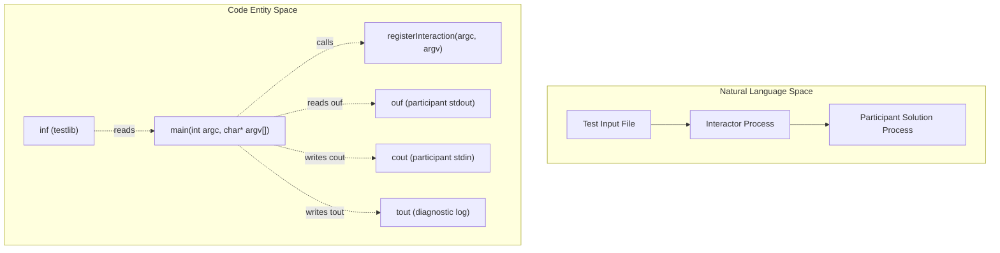
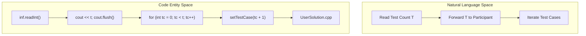

# Interactor Design with testlib

<details>
<summary>Relevant source files</summary>

The following files were used as context for generating this wiki page:
- [.cursor/rules/07-interactor.mdc](https://github.com/7oSkaaa/polygon-problems-generator/blob/main/.cursor/rules/07-interactor.mdc)
- [templates/interactor.cpp](https://github.com/7oSkaaa/polygon-problems-generator/blob/main/templates/interactor.cpp)
- [tutorials/interactor.md](https://github.com/7oSkaaa/polygon-problems-generator/blob/main/tutorials/interactor.md)

</details>


This section covers the technical architecture and design patterns for implementing interactive problem interactors using `testlib.h`. An interactor acts as an active judge program that runs concurrently with a participant's solution, processing queries, validating output constraints, managing query limits, and issuing appropriate verdicts.

Sources: `tutorials/interactor.md:1-10` [tutorials/interactor.md:1-10](https://github.com/7oSkaaa/polygon-problems-generator/blob/main/tutorials/interactor.md#L1-L10), `.cursor/rules/07-interactor.mdc:1-12` [.cursor/rules/07-interactor.mdc:1-12](https://github.com/7oSkaaa/polygon-problems-generator/blob/main/.cursor/rules/07-interactor.mdc#L1-L12)

---

## 1. Registration and Stream Architecture

Every interactor must include `testlib.h` and call `registerInteraction(argc, argv)` inside `main` [[tutorials/interactor.md:13-24](https://github.com/7oSkaaa/polygon-problems-generator/blob/main/tutorials/interactor.md#L13-L24)] [.cursor/rules/07-interactor.mdc:15](https://github.com/7oSkaaa/polygon-problems-generator/blob/main/.cursor/rules/07-interactor.mdc#L15). Unlike standard checkers, interactors manage four distinct I/O streams configured by testlib:

| Stream | Direction | Purpose |
|--------|-----------|---------|
| `inf`  | Interactor reads | Test input file generated by the generator (secret values, limits, test structure) |
| `ouf`  | Interactor reads | Participant's standard output (queries and final answers) |
| `ans`  | Interactor reads | Answer file (rarely used in interactive problems) |
| `cout` | Interactor writes | Participant's standard input (responses sent to the solution) |

**Important Rules:**
- Never read participant output via standard `cin`. Always use `ouf` [[tutorials/interactor.md:34](https://github.com/7oSkaaa/polygon-problems-generator/blob/main/tutorials/interactor.md#L34)] [.cursor/rules/07-interactor.mdc:16](https://github.com/7oSkaaa/polygon-problems-generator/blob/main/.cursor/rules/07-interactor.mdc#L16).
- Always write responses to the participant using `cout` or log them using `tout` [[tutorials/interactor.md:35](https://github.com/7oSkaaa/polygon-problems-generator/blob/main/tutorials/interactor.md#L35)] [.cursor/rules/07-interactor.mdc:17](https://github.com/7oSkaaa/polygon-problems-generator/blob/main/.cursor/rules/07-interactor.mdc#L17).

### Diagram: Interactor Data Flow Architecture



Sources: `tutorials/interactor.md:13-36` [tutorials/interactor.md:13-36](https://github.com/7oSkaaa/polygon-problems-generator/blob/main/tutorials/interactor.md#L13-L36), `.cursor/rules/07-interactor.mdc:15-49` [.cursor/rules/07-interactor.mdc:15-49](https://github.com/7oSkaaa/polygon-problems-generator/blob/main/.cursor/rules/07-interactor.mdc#L15-L49)

---

## 2. Flushing and Idleness Limit Exceeded (ILE)

In interactive problems, every response written to `cout` must be flushed immediately [[tutorials/interactor.md:37-39](https://github.com/7oSkaaa/polygon-problems-generator/blob/main/tutorials/interactor.md#L37-L39)] [.cursor/rules/07-interactor.mdc:17](https://github.com/7oSkaaa/polygon-problems-generator/blob/main/.cursor/rules/07-interactor.mdc#L17). If the interactor fails to flush, the participant's solution will block indefinitely waiting for input, resulting in an **Idleness Limit Exceeded (ILE)** verdict rather than a Wrong Answer [[tutorials/interactor.md:39](https://github.com/7oSkaaa/polygon-problems-generator/blob/main/tutorials/interactor.md#L39)] [.cursor/rules/07-interactor.mdc:34](https://github.com/7oSkaaa/polygon-problems-generator/blob/main/.cursor/rules/07-interactor.mdc#L34).

```cpp
cout << response << "\n";
cout.flush(); // mandatory to prevent solution blocking
```

Additionally, participant solutions must **never** use `ios_base::sync_with_stdio(false); cin.tie(nullptr);` [.cursor/rules/07-interactor.mdc:35](https://github.com/7oSkaaa/polygon-problems-generator/blob/main/.cursor/rules/07-interactor.mdc#L35). Untying `cin` from `cout` destroys the automatic pre-read flush mechanism, which can dead-lock interactive execution.

Sources: `tutorials/interactor.md:37-47` [tutorials/interactor.md:37-47](https://github.com/7oSkaaa/polygon-problems-generator/blob/main/tutorials/interactor.md#L37-L47), `.cursor/rules/07-interactor.mdc:34-35` [.cursor/rules/07-interactor.mdc:34-35](https://github.com/7oSkaaa/polygon-problems-generator/blob/main/.cursor/rules/07-interactor.mdc#L34-L35)

---

## 3. Reading Participant Output Safely and Verdicts

To prevent crashes or undefined behavior when processing malformed participant data, the interactor should utilize testlib's typed read functions on `ouf` [[tutorials/interactor.md:59-70](https://github.com/7oSkaaa/polygon-problems-generator/blob/main/tutorials/interactor.md#L59-L70)] [.cursor/rules/07-interactor.mdc:18](https://github.com/7oSkaaa/polygon-problems-generator/blob/main/.cursor/rules/07-interactor.mdc#L18). If bounds checks fail, testlib automatically assigns a `_wa` or `_pe` verdict [tutorials/interactor.md:69](https://github.com/7oSkaaa/polygon-problems-generator/blob/main/tutorials/interactor.md#L69).

```cpp
int q = ouf.readInt(1, MAX_QUERIES, "query type");
string token = ouf.readToken();
long long x = ouf.readLong(1LL, n, "query value");
```

### Verdict Functions

Interactors terminate execution by invoking `quitf` with specific verdict flags:

```cpp
quitf(_ok, "correct in %d queries", queries);                    // Accepted
quitf(_wa, "wrong answer: expected %d, got %d", expected, got); // Wrong Answer
quitf(_pe, "expected integer, got '%s'", token.c_str());         // Presentation Error
quitf(_fail, "interactor bug: %s", msg);                         // Judge/System Error
```

Use `_fail` strictly for internal interactor or test data errors, not for participant mistakes [[tutorials/interactor.md:54-57](https://github.com/7oSkaaa/polygon-problems-generator/blob/main/tutorials/interactor.md#L54-L57)] [.cursor/rules/07-interactor.mdc:19](https://github.com/7oSkaaa/polygon-problems-generator/blob/main/.cursor/rules/07-interactor.mdc#L19). For partial scoring problems, `quitf(_points, score, ...)` accepts scores in the range `[0.0, 1.0]` [tutorials/interactor.md:161-168](https://github.com/7oSkaaa/polygon-problems-generator/blob/main/tutorials/interactor.md#L161-L168).

Sources: `tutorials/interactor.md:48-70` [tutorials/interactor.md:48-70](https://github.com/7oSkaaa/polygon-problems-generator/blob/main/tutorials/interactor.md#L48-L70), `.cursor/rules/07-interactor.mdc:18-19` [.cursor/rules/07-interactor.mdc:18-19](https://github.com/7oSkaaa/polygon-problems-generator/blob/main/.cursor/rules/07-interactor.mdc#L18-L19)

---

## 4. The `-1` Protocol on Errors

When a participant violates query limits or submits invalid query formats, the interactor must signal failure to the solution **before** terminating via `quitf` [.cursor/rules/07-interactor.mdc:21-26](https://github.com/7oSkaaa/polygon-problems-generator/blob/main/.cursor/rules/07-interactor.mdc#L21-L26).

```cpp
if (queries >= maxQueries) {
    cout << -1 << "\n";
    cout.flush();
    quitf(_wa, "query limit exceeded");
}
```

Solutions must read responses as a `string` and check for `-1` to exit cleanly; reading it as a `char` splits the token and causes a Time Limit Exceeded (TLE) on Codeforces [.cursor/rules/07-interactor.mdc:28-33](https://github.com/7oSkaaa/polygon-problems-generator/blob/main/.cursor/rules/07-interactor.mdc#L28-L33).

```cpp
string resp;
cin >> resp;
if (resp == "-1") exit(0);
```

Sources: `.cursor/rules/07-interactor.mdc:21-33` [.cursor/rules/07-interactor.mdc:21-33](https://github.com/7oSkaaa/polygon-problems-generator/blob/main/.cursor/rules/07-interactor.mdc#L21-L33)

---

## 5. Multi-Test Interactivity and `setTestCase`

For problems featuring multiple test cases ($T$), the interactor must forward $T$ immediately after reading it from `inf`, and invoke `setTestCase(tc + 1)` at the beginning of each iteration [[tutorials/interactor.md:137-156](https://github.com/7oSkaaa/polygon-problems-generator/blob/main/tutorials/interactor.md#L137-L156)] [.cursor/rules/07-interactor.mdc:50-57](https://github.com/7oSkaaa/polygon-problems-generator/blob/main/.cursor/rules/07-interactor.mdc#L50-L57).

```cpp
int t = inf.readInt();
cout << t << "\n";
cout.flush();

for (int tc = 0; tc < t; tc++) {
    setTestCase(tc + 1); // testlib warning triggered if omitted
    int n = inf.readInt();
    // ... execution loop for single test case ...
}
quitf(_ok, "all %d test cases solved", t);
```

Failing to send $T$ causes the participant solution to block on `cin >> t`, resulting in a `CRASHED / exit -1` status in Polygon [[tutorials/interactor.md:155](https://github.com/7oSkaaa/polygon-problems-generator/blob/main/tutorials/interactor.md#L155)] [.cursor/rules/07-interactor.mdc:54](https://github.com/7oSkaaa/polygon-problems-generator/blob/main/.cursor/rules/07-interactor.mdc#L54).

### Diagram: Multi-Test Execution and Synchronization Flow



Sources: `tutorials/interactor.md:137-156` [tutorials/interactor.md:137-156](https://github.com/7oSkaaa/polygon-problems-generator/blob/main/tutorials/interactor.md#L137-L156), `.cursor/rules/07-interactor.mdc:38` [.cursor/rules/07-interactor.mdc:38](https://github.com/7oSkaaa/polygon-problems-generator/blob/main/.cursor/rules/07-interactor.mdc#L38), `.cursor/rules/07-interactor.mdc:50-57` [.cursor/rules/07-interactor.mdc:50-57](https://github.com/7oSkaaa/polygon-problems-generator/blob/main/.cursor/rules/07-interactor.mdc#L50-L57)

---

## 6. Logging with `tout` and Optional Checkers

The `tout` stream is used for diagnostic logging visible to problem setters in Polygon invocations [[tutorials/interactor.md:172-174](https://github.com/7oSkaaa/polygon-problems-generator/blob/main/tutorials/interactor.md#L172-L174)] [.cursor/rules/07-interactor.mdc:36,48](). 

If an optional checker is defined, it runs **after** the interactor issues `_ok`, reading the contents written to `tout` via the checker's own `ouf` stream [[tutorials/interactor.md:175-188](https://github.com/7oSkaaa/polygon-problems-generator/blob/main/tutorials/interactor.md#L175-L188)] [.cursor/rules/07-interactor.mdc:36,39](). For self-sufficient interactors that validate query bounds and secret matches directly via `quitf(_ok, ...)`, no checker is required [[tutorials/interactor.md:189](https://github.com/7oSkaaa/polygon-problems-generator/blob/main/tutorials/interactor.md#L189)] [.cursor/rules/07-interactor.mdc:36](https://github.com/7oSkaaa/polygon-problems-generator/blob/main/.cursor/rules/07-interactor.mdc#L36).

Sources: `tutorials/interactor.md:170-190` [tutorials/interactor.md:170-190](https://github.com/7oSkaaa/polygon-problems-generator/blob/main/tutorials/interactor.md#L170-L190), `.cursor/rules/07-interactor.mdc:36` [.cursor/rules/07-interactor.mdc:36](https://github.com/7oSkaaa/polygon-problems-generator/blob/main/.cursor/rules/07-interactor.mdc#L36), `.cursor/rules/07-interactor.mdc:39` [.cursor/rules/07-interactor.mdc:39](https://github.com/7oSkaaa/polygon-problems-generator/blob/main/.cursor/rules/07-interactor.mdc#L39), `.cursor/rules/07-interactor.mdc:48` [.cursor/rules/07-interactor.mdc:48](https://github.com/7oSkaaa/polygon-problems-generator/blob/main/.cursor/rules/07-interactor.mdc#L48)
