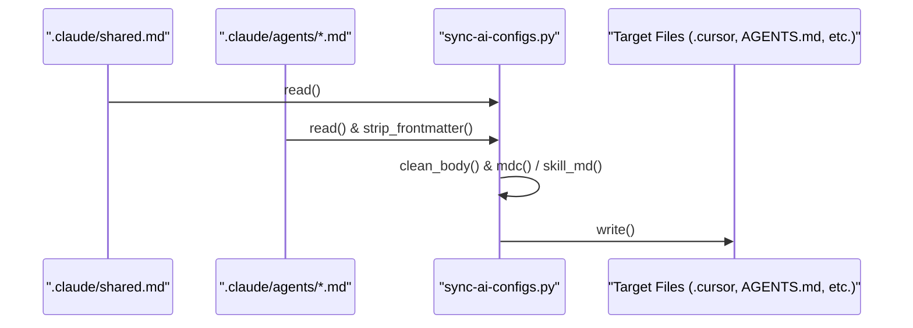

# Multi-Tool Config Sync

<details>
<summary>Relevant source files</summary>

The following files were used as context for generating this wiki page:
- [.agents/skills/orchestrator/SKILL.md](https://github.com/7oSkaaa/polygon-problems-generator/blob/main/.agents/skills/orchestrator/SKILL.md)
- [.claude/agents/orchestrator.md](https://github.com/7oSkaaa/polygon-problems-generator/blob/main/.claude/agents/orchestrator.md)
- [.cursor/rules/00-project.mdc](https://github.com/7oSkaaa/polygon-problems-generator/blob/main/.cursor/rules/00-project.mdc)
- [.github/copilot-instructions.md](https://github.com/7oSkaaa/polygon-problems-generator/blob/main/.github/copilot-instructions.md)
- [.windsurfrules](https://github.com/7oSkaaa/polygon-problems-generator/blob/main/.windsurfrules)
- [sync-ai-configs.py](https://github.com/7oSkaaa/polygon-problems-generator/blob/main/sync-ai-configs.py)

</details>


## Purpose and Scope
This page details the implementation and execution flow of `sync-ai-configs.py`, the build script responsible for synchronizing shared AI assistant instructions and agent role definitions across multiple development tools (`.cursor/rules`, `.github/copilot-instructions.md`, `.windsurfrules`, `AGENTS.md`, and `.agents/skills/`) using `.claude/` as the single source of truth [sync-ai-configs.py:3-17](https://github.com/7oSkaaa/polygon-problems-generator/blob/main/sync-ai-configs.py#L3-L17).

---

## Source of Truth Architecture

The configuration sync mechanism relies on `.claude/shared.md` as the global source of truth for project layout, agent rosters, pipelines, and critical rules, alongside specialist agent files in `.claude/agents/*.md` [sync-ai-configs.py:7-9](https://github.com/7oSkaaa/polygon-problems-generator/blob/main/sync-ai-configs.py#L7-L9). 

The script `sync-ai-configs.py` extracts these documents, strips tool-specific frontmatter or prompt instructions using helper utilities, and compiles target files for external AI coding environments.

```mermaid
graph TD
    sub5["NaturalLanguageSpace"]
    sub6["CodeEntitySpace"]
    sub5 --> sub6
    sub1["(".claude/shared.md" + ".claude/agents/*.md""] --> sub2["sync-ai-configs.py"]
    sub2 --> sub3[".cursor/rules/*.mdc"]
    sub2 --> sub4[".github/copilot-instructions.md"]
    sub2 --> sub7[".windsurfrules"]
    sub2 --> sub8["AGENTS.md"]
    sub2 --> sub9[".agents/skills/*/SKILL.md"]
```
*Sources: [sync-ai-configs.py:3-17](https://github.com/7oSkaaa/polygon-problems-generator/blob/main/sync-ai-configs.py#L3-L17), [.claude/shared.md:1-35](https://github.com/7oSkaaa/polygon-problems-generator/blob/main/.claude/shared.md#L1-L35)*

---

## Core Functions and Data Transformation Flow

The script defines several utility functions to parse, transform, and write configuration files:

- `read(path: Path) -> str`: Safely reads file contents from disk [sync-ai-configs.py:30-31](https://github.com/7oSkaaa/polygon-problems-generator/blob/main/sync-ai-configs.py#L30-L31).
- `write(path: Path, content: str) -> None`: Ensures parent directories exist before writing synchronized text [sync-ai-configs.py:34-38](https://github.com/7oSkaaa/polygon-problems-generator/blob/main/sync-ai-configs.py#L34-L38).
- `strip_frontmatter(text: str) -> tuple[dict, str]`: Separates YAML frontmatter blocks from Markdown body text [sync-ai-configs.py:40-51](https://github.com/7oSkaaa/polygon-problems-generator/blob/main/sync-ai-configs.py#L40-L51).
- `clean_body(body: str) -> str`: Removes Claude-specific startup instructions from agent definitions using regular expressions [sync-ai-configs.py:54-61](https://github.com/7oSkaaa/polygon-problems-generator/blob/main/sync-ai-configs.py#L54-L61).
- `mdc(description: str, body: str, always: bool, globs: list[str]) -> str`: Constructs Cursor-compatible `.mdc` file contents with YAML frontmatter [sync-ai-configs.py:76-85](https://github.com/7oSkaaa/polygon-problems-generator/blob/main/sync-ai-configs.py#L76-L85).
- `skill_md(name: str, description: str, body: str) -> str`: Generates standardized skill wrapper files for Agent-based toolsets [sync-ai-configs.py:158-162](https://github.com/7oSkaaa/polygon-problems-generator/blob/main/sync-ai-configs.py#L158-L162).


*Sources: [sync-ai-configs.py:30-85](https://github.com/7oSkaaa/polygon-problems-generator/blob/main/sync-ai-configs.py#L30-L85), [sync-ai-configs.py:158-171](https://github.com/7oSkaaa/polygon-problems-generator/blob/main/sync-ai-configs.py#L158-L171)*

---

## Target File Generation Mappings

`sync-ai-configs.py` populates distinct directory structures and files based on rules mapped in Python dictionaries:

| Target Path | Source Component | Generation Function / Logic |
|---|---|---|
| `.cursor/rules/00-project.mdc` | `.claude/shared.md` | `mdc()` with `alwaysApply: true` [sync-ai-configs.py:88-93](https://github.com/7oSkaaa/polygon-problems-generator/blob/main/sync-ai-configs.py#L88-L93) |
| `.cursor/rules/*.mdc` | `.claude/agents/*.md` | `mdc()` with glob patterns per role [sync-ai-configs.py:94-128](https://github.com/7oSkaaa/polygon-problems-generator/blob/main/sync-ai-configs.py#L94-L128) |
| `.github/copilot-instructions.md` | `.claude/shared.md` | Concatenation with `GENERATED_HEADER` [sync-ai-configs.py:133-136](https://github.com/7oSkaaa/polygon-problems-generator/blob/main/sync-ai-configs.py#L133-L136) |
| `.windsurfrules` | `.claude/shared.md` | Concatenation with `GENERATED_HEADER` [sync-ai-configs.py:138-141](https://github.com/7oSkaaa/polygon-problems-generator/blob/main/sync-ai-configs.py#L138-L141) |
| `AGENTS.md` | `.claude/shared.md` + agents | Aggregated role sections [sync-ai-configs.py:143-155](https://github.com/7oSkaaa/polygon-problems-generator/blob/main/sync-ai-configs.py#L143-L155) |
| `.agents/skills/<name>/SKILL.md` | `.claude/agents/*.md` | `skill_md()` wrapper generation [sync-ai-configs.py:165-171](https://github.com/7oSkaaa/polygon-problems-generator/blob/main/sync-ai-configs.py#L165-L171) |

*Sources: [[sync-ai-configs.py:88-171](https://github.com/7oSkaaa/polygon-problems-generator/blob/main/sync-ai-configs.py#L88-L171)]*
