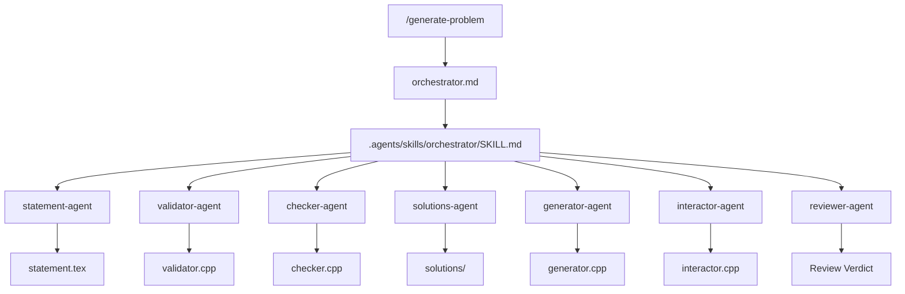
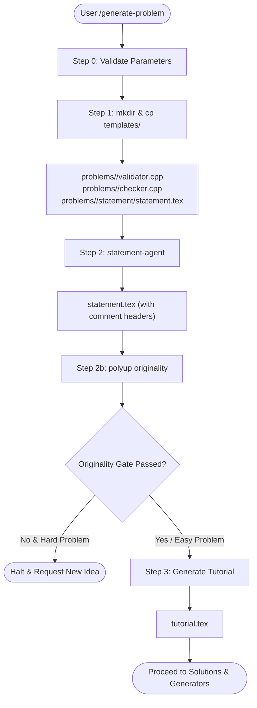

# Orchestrator and Slash Commands

<details>
<summary>Relevant source files</summary>

The following files were used as context for generating this wiki page:
- [.agents/skills/orchestrator/SKILL.md](https://github.com/7oSkaaa/polygon-problems-generator/blob/main/.agents/skills/orchestrator/SKILL.md)
- [.claude/agents/orchestrator.md](https://github.com/7oSkaaa/polygon-problems-generator/blob/main/.claude/agents/orchestrator.md)
- [.claude/commands/fix-component.md](https://github.com/7oSkaaa/polygon-problems-generator/blob/main/.claude/commands/fix-component.md)
- [.claude/commands/generate-problem.md](https://github.com/7oSkaaa/polygon-problems-generator/blob/main/.claude/commands/generate-problem.md)
- [sync-ai-configs.py](https://github.com/7oSkaaa/polygon-problems-generator/blob/main/sync-ai-configs.py)

</details>


## Purpose and Scope
This page details the Orchestrator agent architecture, the execution steps of the `/generate-problem` pipeline, and the remediation workflow governed by the `/fix-component` command [.agents/skills/orchestrator/SKILL.md:1-30](https://github.com/7oSkaaa/polygon-problems-generator/blob/main/.agents/skills/orchestrator/SKILL.md#L1-L30), [.claude/commands/generate-problem.md:1-22](https://github.com/7oSkaaa/polygon-problems-generator/blob/main/.claude/commands/generate-problem.md#L1-L22), [.claude/commands/fix-component.md:1-10](https://github.com/7oSkaaa/polygon-problems-generator/blob/main/.claude/commands/fix-component.md#L1-L10). The orchestrator acts as the central coordinator that maps high-level user requirements into specific problem component files using specialized sub-agents.

Sources: [.agents/skills/orchestrator/SKILL.md:1-30](https://github.com/7oSkaaa/polygon-problems-generator/blob/main/.agents/skills/orchestrator/SKILL.md#L1-L30), [.claude/commands/generate-problem.md:1-22](https://github.com/7oSkaaa/polygon-problems-generator/blob/main/.claude/commands/generate-problem.md#L1-L22), [.claude/commands/fix-component.md:1-10](https://github.com/7oSkaaa/polygon-problems-generator/blob/main/.claude/commands/fix-component.md#L1-L10)

---

## Orchestrator Architecture & Sub-Agent Roster

The orchestrator is defined via configuration stubs and skill definitions located at [.agents/skills/orchestrator/SKILL.md:1-30](https://github.com/7oSkaaa/polygon-problems-generator/blob/main/.agents/skills/orchestrator/SKILL.md#L1-L30) and [.claude/agents/orchestrator.md:1-26](https://github.com/7oSkaaa/polygon-problems-generator/blob/main/.claude/agents/orchestrator.md#L1-L26). It receives problem descriptions, parameters (`multitest`, `interactive`), and coordinates sub-agent invocations using the Agent tool. 

The mapping between natural language problem tasks and concrete sub-agent identifiers (`subagent_type`) is managed according to the orchestrator registry:

| Natural Language Task | Sub-Agent Identifier (`subagent_type`) | Target Files / Scope |
|---|---|---|
| Generate or refine statement / tutorial | `statement-agent` | `problems/<name>/statement/statement.tex`, `tutorial.tex` [.agents/skills/orchestrator/SKILL.md:20](https://github.com/7oSkaaa/polygon-problems-generator/blob/main/.agents/skills/orchestrator/SKILL.md#L20) |
| Generate or refine validator | `validator-agent` | `problems/<name>/validator.cpp` [.agents/skills/orchestrator/SKILL.md:21](https://github.com/7oSkaaa/polygon-problems-generator/blob/main/.agents/skills/orchestrator/SKILL.md#L21) |
| Recommend or generate checker | `checker-agent` | `problems/<name>/checker.cpp` [.agents/skills/orchestrator/SKILL.md:22](https://github.com/7oSkaaa/polygon-problems-generator/blob/main/.agents/skills/orchestrator/SKILL.md#L22) |
| Suggest approach or generate solution | `solutions-agent` | `problems/<name>/solutions/*.cpp` or `*.java` [.agents/skills/orchestrator/SKILL.md:23](https://github.com/7oSkaaa/polygon-problems-generator/blob/main/.agents/skills/orchestrator/SKILL.md#L23) |
| Generate generator or stress script | `generator-agent` | `problems/<name>/generators/generator.cpp` [.agents/skills/orchestrator/SKILL.md:24](https://github.com/7oSkaaa/polygon-problems-generator/blob/main/.agents/skills/orchestrator/SKILL.md#L24) |
| Generate interactor (interactive only) | `interactor-agent` | `problems/<name>/interactor.cpp` [.agents/skills/orchestrator/SKILL.md:25](https://github.com/7oSkaaa/polygon-problems-generator/blob/main/.agents/skills/orchestrator/SKILL.md#L25) |
| Review component or full problem | `reviewer-agent` | Full component validation check [.agents/skills/orchestrator/SKILL.md:26](https://github.com/7oSkaaa/polygon-problems-generator/blob/main/.agents/skills/orchestrator/SKILL.md#L26) |

### Diagram: Natural Language to Code Entity Mapping

Title: "Orchestrator Sub-Agent Resolution Flow"



Sources: [.agents/skills/orchestrator/SKILL.md:1-30](https://github.com/7oSkaaa/polygon-problems-generator/blob/main/.agents/skills/orchestrator/SKILL.md#L1-L30), [.claude/agents/orchestrator.md:1-26](https://github.com/7oSkaaa/polygon-problems-generator/blob/main/.claude/agents/orchestrator.md#L1-L26)

---

## The `/generate-problem` Pipeline

The `/generate-problem` command implements a multi-step generation pipeline [.claude/commands/generate-problem.md:1-140](https://github.com/7oSkaaa/polygon-problems-generator/blob/main/.claude/commands/generate-problem.md#L1-L140). It requires explicit parameters: `name`, `statement`, `solution`, `constraints`, and `sample tests`, while `multitest` (default `yes`) and `interactive` (default `no`) are optional [.claude/commands/generate-problem.md:5-17](https://github.com/7oSkaaa/polygon-problems-generator/blob/main/.claude/commands/generate-problem.md#L5-L17).

### Pipeline Execution Steps

1. **Step 0 — Validate parameters**: Extracts and validates required fields. Derives the human-readable title by replacing `_` with spaces and capitalizing words (e.g., `carrot_sum` $\rightarrow$ `Carrot Sum`) [.claude/commands/generate-problem.md:25-41](https://github.com/7oSkaaa/polygon-problems-generator/blob/main/.claude/commands/generate-problem.md#L25-L41). Classifies tentative difficulty into `problems/<name>/difficulty.txt` [.claude/commands/generate-problem.md:42](https://github.com/7oSkaaa/polygon-problems-generator/blob/main/.claude/commands/generate-problem.md#L42).
2. **Step 1 — Create problem folder**: Initializes file structures using Bash, copying templates from `templates/` into `problems/<name>/` [.claude/commands/generate-problem.md:58-72](https://github.com/7oSkaaa/polygon-problems-generator/blob/main/.claude/commands/generate-problem.md#L58-L72).
3. **Step 2 — Generate statement**: Spawns `statement-agent` to produce statement sections (`=== TITLE ===`, `=== LEGEND ===`, `=== INPUT ===`, `=== OUTPUT ===`, `=== NOTES ===`, and optional `=== INTERACTION ===`) [.claude/commands/generate-problem.md:78-104](https://github.com/7oSkaaa/polygon-problems-generator/blob/main/.claude/commands/generate-problem.md#L78-L104). Ensures mandatory comment-style section headers (`% ─── Legend ───`, etc.) are present for `polyup/parsers.py` [.claude/commands/generate-problem.md:106-116](https://github.com/7oSkaaa/polygon-problems-generator/blob/main/.claude/commands/generate-problem.md#L106-L116).
4. **Step 2b — Originality check**: Executes `python3 -m polyup originality <name>` [.claude/commands/generate-problem.md:122-126](https://github.com/7oSkaaa/polygon-problems-generator/blob/main/.claude/commands/generate-problem.md#L122-L126). If the check exits with `1` (near-duplicate) and difficulty is higher than `Ace` or `Div2-A`, the pipeline halts [.claude/commands/generate-problem.md:128](https://github.com/7oSkaaa/polygon-problems-generator/blob/main/.claude/commands/generate-problem.md#L128).
5. **Step 3 — Generate tutorial**: Spawns `statement-agent` to generate the problem tutorial in `problems/<name>/statement/tutorial.tex` [.claude/commands/generate-problem.md:134-140](https://github.com/7oSkaaa/polygon-problems-generator/blob/main/.claude/commands/generate-problem.md#L134-L140).

### Diagram: Pipeline State Flow and Code Entity Mapping

Title: "Pipeline State Machine and File Generation"



Sources: [.claude/commands/generate-problem.md:1-140](https://github.com/7oSkaaa/polygon-problems-generator/blob/main/.claude/commands/generate-problem.md#L1-L140)

---

## The `/fix-component` Remediation Loop

When a component fails verification (via `./verify.sh`) or encounters a Polygon warning, the `/fix-component` command is invoked rather than regenerating the entire problem [.claude/commands/fix-component.md:1-23](https://github.com/7oSkaaa/polygon-problems-generator/blob/main/.claude/commands/fix-component.md#L1-L23).

### Parameters and Execution Flow

* **Parameters required**: 
  * `name`: Target directory under `problems/` [.claude/commands/fix-component.md:7](https://github.com/7oSkaaa/polygon-problems-generator/blob/main/.claude/commands/fix-component.md#L7)
  * `component`: Target identifier (`statement`, `tutorial`, `validator`, `checker`, `interactor`, `acc`, `acc_java`, `acc_alt`, `brute`, `wa`, `generator`) [.claude/commands/fix-component.md:8](https://github.com/7oSkaaa/polygon-problems-generator/blob/main/.claude/commands/fix-component.md#L8)
  * `issue`: Log excerpt, compilation error, or test failure section [.claude/commands/fix-component.md:9](https://github.com/7oSkaaa/polygon-problems-generator/blob/main/.claude/commands/fix-component.md#L9)

### Remediation Steps

1. The orchestrator reads `guidelines.md` and the existing source file for the specified component [.claude/commands/fix-component.md:17](https://github.com/7oSkaaa/polygon-problems-generator/blob/main/.claude/commands/fix-component.md#L17).
2. Spawns the corresponding sub-agent, supplying the existing code and the failure log as feedback [.claude/commands/fix-component.md:17](https://github.com/7oSkaaa/polygon-problems-generator/blob/main/.claude/commands/fix-component.md#L17).
3. Overwrites the patched file on disk [.claude/commands/fix-component.md:17](https://github.com/7oSkaaa/polygon-problems-generator/blob/main/.claude/commands/fix-component.md#L17).
4. Executes the local verification harness to confirm resolution:
   ```bash
   ./verify.sh problems/<name>
   ```
   [.claude/commands/fix-component.md:19-21](https://github.com/7oSkaaa/polygon-problems-generator/blob/main/.claude/commands/fix-component.md#L19-L21)

Sources: [.claude/commands/fix-component.md:1-23](https://github.com/7oSkaaa/polygon-problems-generator/blob/main/.claude/commands/fix-component.md#L1-L23)
