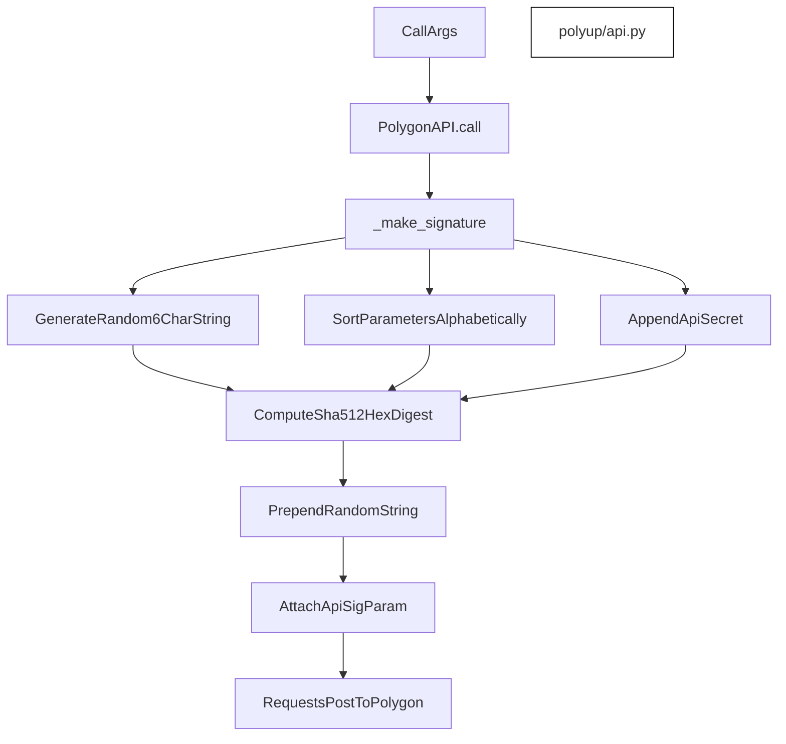
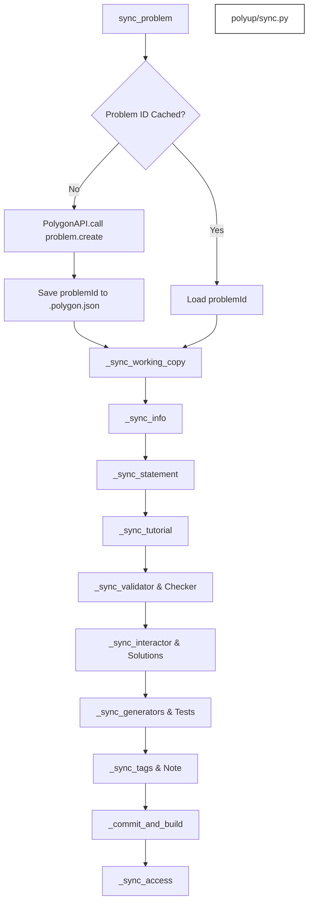
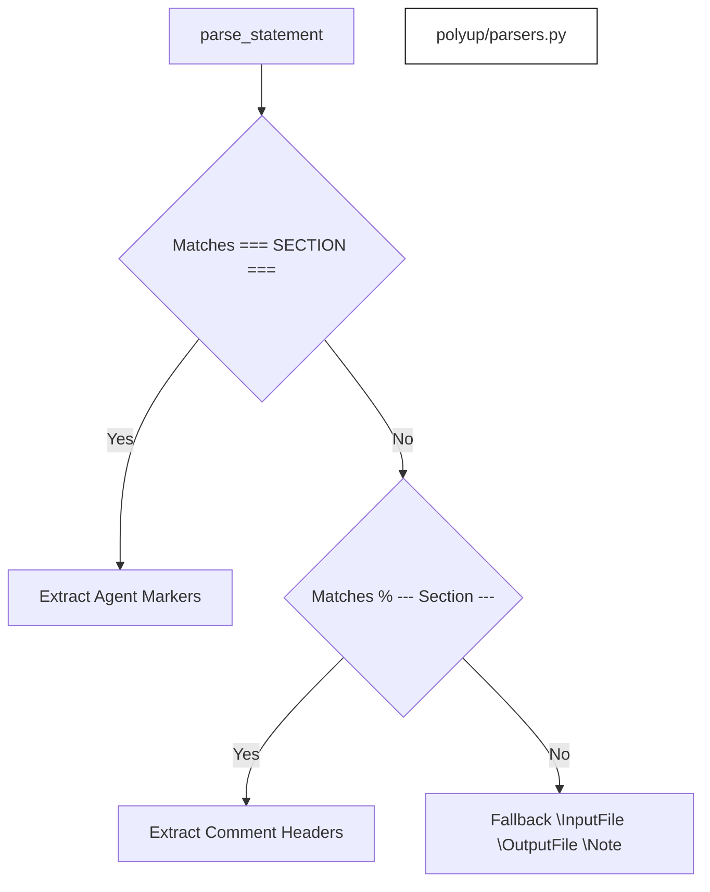

# Polygon API Client & Sync

<details>
<summary>Relevant source files</summary>

The following files were used as context for generating this wiki page:
- [polyup/api.py](https://github.com/7oSkaaa/polygon-problems-generator/blob/main/polyup/api.py)
- [polyup/parsers.py](https://github.com/7oSkaaa/polygon-problems-generator/blob/main/polyup/parsers.py)
- [polyup/sync.py](https://github.com/7oSkaaa/polygon-problems-generator/blob/main/polyup/sync.py)

</details>


This page details the implementation of the Polygon API client, the problem synchronization toolchain, and the file parsers within the `polyup` package. It covers cryptographic request signing (`api.py`), local-to-remote component upload orchestration (`sync.py`), and LaTeX statement/tutorial parsing (`parsers.py`).

---

## 1. Request Signing & API Client (`api.py`)

The `PolygonAPI` class in `polyup/api.py` manages communication with the Codeforces Polygon API (`https://polygon.codeforces.com/api`). Because Polygon requires all requests to be cryptographically signed using a shared secret and a randomized prefix, `api.py` implements a strict signature generation algorithm.

### Request Signing Algorithm (`_make_signature`)

To sign an API call, `_make_signature` performs the following steps:
1. Generates a random 6-character alphanumeric string (`rand`).
2. Constructs a signature byte string consisting of `rand`, the HTTP `method`, a question mark `?`, sorted query parameters joined by `&`, a pound sign `#`, and the `api_secret`.
3. Computes the SHA-512 hexadecimal digest of this byte string and prefixes it with `rand`.
4. When file uploads are present (`_files`), the binary content of the file is included in the parameter map so that Polygon can verify data integrity.


*Sources: [polyup/api.py:14-47](https://github.com/7oSkaaa/polygon-problems-generator/blob/main/polyup/api.py#L14-L47)*

### `PolygonAPI` Execution Flow

The `PolygonAPI.call` method handles parameter filtration, signature attachment, rate-limiting delays, and JSON response validation:
* **Parameters & Authentication**: Injects `apiKey` and current UNIX epoch `time` into the request payload [polyup/api.py:31-35](https://github.com/7oSkaaa/polygon-problems-generator/blob/main/polyup/api.py#L31-L35).
* **File Handling**: If `_files` is provided, file byte content is bound into the parameter dictionary before signing [polyup/api.py:36-41](https://github.com/7oSkaaa/polygon-problems-generator/blob/main/polyup/api.py#L36-L41).
* **Error Handling**: Non-JSON responses or API statuses other than `OK` trigger fatal terminations (`sys.exit(1)`) unless `fatal=False` is explicitly passed [polyup/api.py:48-60](https://github.com/7oSkaaa/polygon-problems-generator/blob/main/polyup/api.py#L48-L60).
* **Rate Limiting**: Enforces a configurable delay (`self.delay`, default `0.3` seconds) between successful calls [polyup/api.py:26,62]().

Sources: [polyup/api.py:1-65](https://github.com/7oSkaaa/polygon-problems-generator/blob/main/polyup/api.py#L1-L65)

---

## 2. Problem Sync Flow & Orchestration (`sync.py`)

The `sync_problem` function in `polyup/sync.py` coordinates the complete lifecycle of uploading a local problem directory to Polygon, maintaining an internal `.polygon.json` cache of the remote problem ID.

### Synchronization Pipeline

If a problem ID is cached locally in `.polygon.json`, it reuses it; otherwise, it invokes `problem.create` on the Polygon API [polyup/sync.py:24-41](https://github.com/7oSkaaa/polygon-problems-generator/blob/main/polyup/sync.py#L24-L41). It then sequentially synchronizes all components of the problem package.


*Sources: [polyup/sync.py:17-70](https://github.com/7oSkaaa/polygon-problems-generator/blob/main/polyup/sync.py#L17-L70)*

### Time Limit Normalization (`_time_limit_ms`)

Polygon imposes strict constraints on time limits. The helper `_time_limit_ms` ensures that problem time limits fall within `[250, 15000]` milliseconds and are strictly divisible by `50` [polyup/sync.py:82-90](https://github.com/7oSkaaa/polygon-problems-generator/blob/main/polyup/sync.py#L82-L90).

```python
# Conceptual representation of time limit rounding rule
def _time_limit_ms(ms: int) -> int:
    value = max(250, min(15_000, int(ms)))
    rounded = int(round(value / 50) * 50)
    return max(250, min(15_000, rounded))
```

### Component Upload Functions

Each problem component is uploaded using specific Polygon API endpoints:
* **Working Copy**: Refreshes the working copy via `problem.updateWorkingCopy` [polyup/sync.py:92-95](https://github.com/7oSkaaa/polygon-problems-generator/blob/main/polyup/sync.py#L92-L95).
* **Info**: Sets limits and I/O files via `problem.updateInfo` [polyup/sync.py:97-106](https://github.com/7oSkaaa/polygon-problems-generator/blob/main/polyup/sync.py#L97-L106).
* **Statement & Tutorial**: Parses and uploads via `problem.saveStatement` and `problem.saveGeneralTutorial` [polyup/sync.py:109-137](https://github.com/7oSkaaa/polygon-problems-generator/blob/main/polyup/sync.py#L109-L137).
* **Validators & Checkers**: Uploads source files with `problem.saveFile` and registers them via `problem.setValidator` / `problem.setChecker` (handling standard checkers via `std::<name>.cpp`) [polyup/sync.py:139-173](https://github.com/7oSkaaa/polygon-problems-generator/blob/main/polyup/sync.py#L139-L173).
* **Interactors**: Uploads and sets interactor scripts if `interactor.cpp` is present [polyup/sync.py:175-182](https://github.com/7oSkaaa/polygon-problems-generator/blob/main/polyup/sync.py#L175-L182).

Sources: [polyup/sync.py:1-193](https://github.com/7oSkaaa/polygon-problems-generator/blob/main/polyup/sync.py#L1-L193)

---

## 3. Problem Parsers (`parsers.py`)

The `polyup/parsers.py` module extracts structural components from problem LaTeX files and source code annotations.

### Statement Parsing (`parse_statement`)

`parse_statement` reads `statement/statement.tex` and extracts problem sections (`legend`, `input`, `output`, `notes`, `interaction`). It handles three distinct formats in order of precedence:
1. **Agent-Generated Section Markers**: Matches `=== LEGEND ===`, `=== INPUT ===`, etc. [polyup/parsers.py:13-23](https://github.com/7oSkaaa/polygon-problems-generator/blob/main/polyup/parsers.py#L13-L23)
2. **Comment-Header Format**: Matches LaTeX comment blocks such as `% ─── Legend ───` [polyup/parsers.py:25-38](https://github.com/7oSkaaa/polygon-problems-generator/blob/main/polyup/parsers.py#L25-L38)
3. **Fallback LaTeX Commands**: Parses traditional commands like `\InputFile`, `\OutputFile`, and `\Note` [polyup/parsers.py:40-54](https://github.com/7oSkaaa/polygon-problems-generator/blob/main/polyup/parsers.py#L40-L54)


*Sources: [polyup/parsers.py:9-56](https://github.com/7oSkaaa/polygon-problems-generator/blob/main/polyup/parsers.py#L9-L56)*

### Additional Parser Utilities

* **`parse_tutorial(tex_path)`**: Reads `tutorial.tex`, strips comment lines, and formats section markers like `=== KEY OBSERVATIONS ===` into bold LaTeX headings (`\textbf{Key Observations}`) [polyup/parsers.py:59-68](https://github.com/7oSkaaa/polygon-problems-generator/blob/main/polyup/parsers.py#L59-L68).
* **`detect_standard_checker(checker_path)`**: Scans `checker.cpp` for references to standard testlib checkers (e.g., `standard checker: wcmp`) against `STANDARD_CHECKERS` [polyup/parsers.py:71-76](https://github.com/7oSkaaa/polygon-problems-generator/blob/main/polyup/parsers.py#L71-L76).
* **`extract_freemarker_script(generator_path)`**: Extracts embedded FreeMarker generator scripts from generator file docstrings [polyup/parsers.py:79-85](https://github.com/7oSkaaa/polygon-problems-generator/blob/main/polyup/parsers.py#L79-L85).
* **`detect_problem_name(problem_dir)`**: Extracts the problem title from statement LaTeX tags or falls back to a title-cased directory name [polyup/parsers.py:88-94](https://github.com/7oSkaaa/polygon-problems-generator/blob/main/polyup/parsers.py#L88-L94).

Sources: [polyup/parsers.py:1-94](https://github.com/7oSkaaa/polygon-problems-generator/blob/main/polyup/parsers.py#L1-L94)
