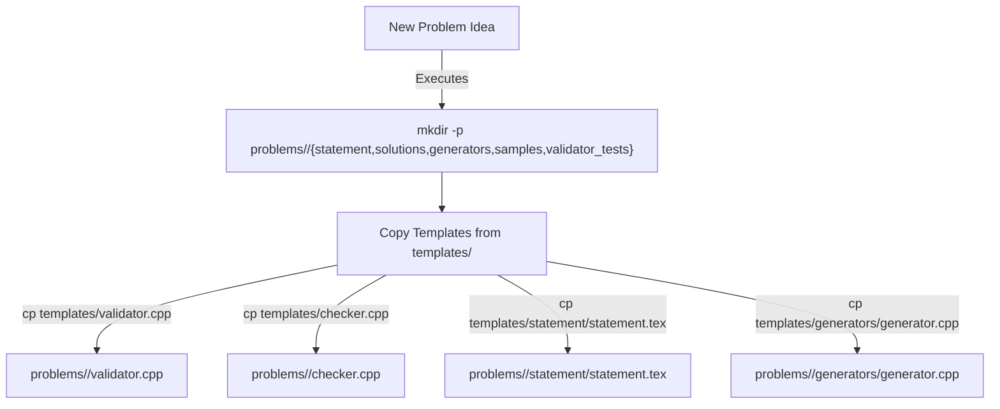
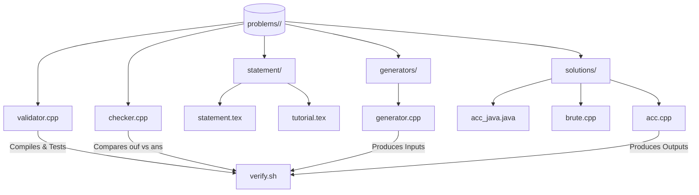

# Problem Directory Layout

<details>
<summary>Relevant source files</summary>

The following files were used as context for generating this wiki page:
- [AGENTS.md](https://github.com/7oSkaaa/polygon-problems-generator/blob/main/AGENTS.md)
- [templates/checker.cpp](https://github.com/7oSkaaa/polygon-problems-generator/blob/main/templates/checker.cpp)
- [templates/generators/generator.cpp](https://github.com/7oSkaaa/polygon-problems-generator/blob/main/templates/generators/generator.cpp)
- [templates/solutions/solution.cpp](https://github.com/7oSkaaa/polygon-problems-generator/blob/main/templates/solutions/solution.cpp)
- [templates/solutions/solution.java](https://github.com/7oSkaaa/polygon-problems-generator/blob/main/templates/solutions/solution.java)
- [templates/statement/raw.tex](https://github.com/7oSkaaa/polygon-problems-generator/blob/main/templates/statement/raw.tex)
- [templates/statement/statement.tex](https://github.com/7oSkaaa/polygon-problems-generator/blob/main/templates/statement/statement.tex)
- [templates/statement/tutorial.tex](https://github.com/7oSkaaa/polygon-problems-generator/blob/main/templates/statement/tutorial.tex)
- [templates/validator.cpp](https://github.com/7oSkaaa/polygon-problems-generator/blob/main/templates/validator.cpp)
- [tutorials/generator.md](https://github.com/7oSkaaa/polygon-problems-generator/blob/main/tutorials/generator.md)

</details>


## Purpose and Scope

This section details the physical layout of problem directories under `problems/<name>/` and the template structures under `templates/` within the repository [AGENTS.md:35-64](https://github.com/7oSkaaa/polygon-problems-generator/blob/main/AGENTS.md#L35-L64). Every competitive programming problem must be self-contained in its own directory using `snake_case` naming conventions (`problems/<name>/`), ensuring clean isolation from the repository root [AGENTS.md:87-88](https://github.com/7oSkaaa/polygon-problems-generator/blob/main/AGENTS.md#L87-L88). 

---

## Directory Structure and Bootstrapping

Problems are initialized from template assets using a standardized directory scaffolding command [AGENTS.md:53-64](https://github.com/7oSkaaa/polygon-problems-generator/blob/main/AGENTS.md#L53-L64). The hierarchy includes statement assets, solutions across multiple languages and paradigms, test generators, validators, checkers, and optional interactors [AGENTS.md:35-51](https://github.com/7oSkaaa/polygon-problems-generator/blob/main/AGENTS.md#L35-L51).

```
problems/<name>/
├── statement/
│   ├── statement.tex
│   └── tutorial.tex
├── solutions/
│   ├── acc.cpp
│   ├── acc_java.java
│   ├── acc_alt.cpp
│   ├── brute.cpp
│   └── wa.cpp
├── generators/
│   └── generator.cpp
├── validator.cpp
├── checker.cpp
└── interactor.cpp
```

### Problem Bootstrapping Flow

The following diagram bridges the natural language concept of problem initialization to the exact shell commands and template file entities executed during setup.



Sources: [AGENTS.md:35-64](https://github.com/7oSkaaa/polygon-problems-generator/blob/main/AGENTS.md#L35-L64)

---

## Problem Component Layout

### Statement Assets (`statement/`)
The statement directory contains LaTeX source files structured for Polygon ingestion and PDF rendering [templates/statement/statement.tex:1-34](https://github.com/7oSkaaa/polygon-problems-generator/blob/main/templates/statement/statement.tex#L1-L34), [templates/statement/tutorial.tex:1-17](https://github.com/7oSkaaa/polygon-problems-generator/blob/main/templates/statement/tutorial.tex#L1-L17).
- `raw.tex`: Scratchpad file for draft notes, rough ideas, and unformatted constraints [templates/statement/raw.tex:1-13](https://github.com/7oSkaaa/polygon-problems-generator/blob/main/templates/statement/raw.tex#L1-L13).
- `statement.tex`: Final formatted LaTeX statement featuring sections for Legend, Input, Interaction (if interactive), Output, and Notes [templates/statement/statement.tex:1-34](https://github.com/7oSkaaa/polygon-problems-generator/blob/main/templates/statement/statement.tex#L1-L34). All variables must be in math mode, relational operators use explicit LaTeX symbols (`\leq`, `\geq`, `\neq`), and multiplication uses `\times` [AGENTS.md:99](https://github.com/7oSkaaa/polygon-problems-generator/blob/main/AGENTS.md#L99), [templates/statement/tutorial.tex:1-7](https://github.com/7oSkaaa/polygon-problems-generator/blob/main/templates/statement/tutorial.tex#L1-L7).
- `tutorial.tex`: Editorial solution explanation breaking down key observations, algorithmic details, and time/space complexities [templates/statement/tutorial.tex:1-17](https://github.com/7oSkaaa/polygon-problems-generator/blob/main/templates/statement/tutorial.tex#L1-L17).

Sources: [templates/statement/statement.tex:1-34](https://github.com/7oSkaaa/polygon-problems-generator/blob/main/templates/statement/statement.tex#L1-L34), [templates/statement/tutorial.tex:1-17](https://github.com/7oSkaaa/polygon-problems-generator/blob/main/templates/statement/tutorial.tex#L1-L17), [templates/statement/raw.tex:1-13](https://github.com/7oSkaaa/polygon-problems-generator/blob/main/templates/statement/raw.tex#L1-L13)

### Solutions (`solutions/`)
All solutions reside in `problems/<name>/solutions/` and follow strict role-based naming conventions [AGENTS.md:40-45](https://github.com/7oSkaaa/polygon-problems-generator/blob/main/AGENTS.md#L40-L45) without using `#pragma` optimizations, `freopen`, or macros [AGENTS.md:89-96](https://github.com/7oSkaaa/polygon-problems-generator/blob/main/AGENTS.md#L89-L96).
- `acc.cpp`: Main accepted C++ solution using the minimal C++17 template (`templates/solutions/solution.cpp`) [AGENTS.md:41](https://github.com/7oSkaaa/polygon-problems-generator/blob/main/AGENTS.md#L41), [templates/solutions/solution.cpp:1-18](https://github.com/7oSkaaa/polygon-problems-generator/blob/main/templates/solutions/solution.cpp#L1-L18).
- `acc_java.java`: Java equivalent implementing the standard structure with `Scanner` and a static `solve()` method (`templates/solutions/solution.java`) [AGENTS.md:42](https://github.com/7oSkaaa/polygon-problems-generator/blob/main/AGENTS.md#L42), [templates/solutions/solution.java:1-16](https://github.com/7oSkaaa/polygon-problems-generator/blob/main/templates/solutions/solution.java#L1-L16).
- `acc_alt.cpp`: Second accepted solution implementing a distinct algorithmic approach [AGENTS.md:43](https://github.com/7oSkaaa/polygon-problems-generator/blob/main/AGENTS.md#L43).
- `brute.cpp`: Brute-force reference solution used for stress testing and validation [AGENTS.md:44](https://github.com/7oSkaaa/polygon-problems-generator/blob/main/AGENTS.md#L44).
- `wa.cpp`: Intentionally wrong solution designed to verify that the checker flags incorrect outputs [AGENTS.md:45](https://github.com/7oSkaaa/polygon-problems-generator/blob/main/AGENTS.md#L45).

Sources: [AGENTS.md:40-45](https://github.com/7oSkaaa/polygon-problems-generator/blob/main/AGENTS.md#L40-L45), [templates/solutions/solution.cpp:1-18](https://github.com/7oSkaaa/polygon-problems-generator/blob/main/templates/solutions/solution.cpp#L1-L18), [templates/solutions/solution.java:1-16](https://github.com/7oSkaaa/polygon-problems-generator/blob/main/templates/solutions/solution.java#L1-L16)

### Generators and FreeMarker Scripts (`generators/`)
Test case generation is handled by `generator.cpp`, which leverages `testlib.h` random routines (`rnd`) and command-line parsing (`opt`) [tutorials/generator.md:1-42](https://github.com/7oSkaaa/polygon-problems-generator/blob/main/tutorials/generator.md#L1-L42), [templates/generators/generator.cpp:1-65](https://github.com/7oSkaaa/polygon-problems-generator/blob/main/templates/generators/generator.cpp#L1-L65).

- **Initialization**: Must invoke `registerGen(argc, argv, 1)` as the first line of `main` [tutorials/generator.md:46-56](https://github.com/7oSkaaa/polygon-problems-generator/blob/main/tutorials/generator.md#L46-L56).
- **Parameter Handling**: Uses `opt<T>("name")` to capture test size configurations, value ranges, and distribution bounds [tutorials/generator.md:73-81](https://github.com/7oSkaaa/polygon-problems-generator/blob/main/tutorials/generator.md#L73-L81).
- **FreeMarker Embedding**: Test script loops are embedded as comments within `generator.cpp` to automate test invocation creation in Polygon [tutorials/generator.md:121-181](https://github.com/7oSkaaa/polygon-problems-generator/blob/main/tutorials/generator.md#L121-L181), [templates/generators/generator.cpp:42-59](https://github.com/7oSkaaa/polygon-problems-generator/blob/main/templates/generators/generator.cpp#L42-L59). The executable name in the FreeMarker script must match the base name of the generator file [tutorials/generator.md:126-136](https://github.com/7oSkaaa/polygon-problems-generator/blob/main/tutorials/generator.md#L126-L136).

Sources: [tutorials/generator.md:1-181](https://github.com/7oSkaaa/polygon-problems-generator/blob/main/tutorials/generator.md#L1-L181), [templates/generators/generator.cpp:1-65](https://github.com/7oSkaaa/polygon-problems-generator/blob/main/templates/generators/generator.cpp#L1-L65)

### Validator, Checker, and Interactor

- `validator.cpp`: Uses `registerValidation(argc, argv)` and `testlib.h` input streams (`inf`) to validate test cases, tracking cumulative bounds (e.g., $\sum n \leq 10^5$) via `ensuref` [templates/validator.cpp:1-32](https://github.com/7oSkaaa/polygon-problems-generator/blob/main/templates/validator.cpp#L1-L32).
- `checker.cpp`: Implements custom validation logic using `registerTestlibCmd(argc, argv)` and the `readAns` paradigm when standard checkers (`wcmp`, `ncmp`, `yesno`, `nyesno`) are insufficient [templates/checker.cpp:1-35](https://github.com/7oSkaaa/polygon-problems-generator/blob/main/templates/checker.cpp#L1-L35).
- `interactor.cpp`: Required exclusively for interactive problems, managing real-time input/output streams and flushing between the judge and participant program [AGENTS.md:50](https://github.com/7oSkaaa/polygon-problems-generator/blob/main/AGENTS.md#L50), [AGENTS.md:111](https://github.com/7oSkaaa/polygon-problems-generator/blob/main/AGENTS.md#L111).

Sources: [templates/validator.cpp:1-32](https://github.com/7oSkaaa/polygon-problems-generator/blob/main/templates/validator.cpp#L1-L32), [templates/checker.cpp:1-35](https://github.com/7oSkaaa/polygon-problems-generator/blob/main/templates/checker.cpp#L1-L35), [AGENTS.md:50](https://github.com/7oSkaaa/polygon-problems-generator/blob/main/AGENTS.md#L50)

---

## Problem Component Entity Mapping

The following diagram maps problem directory code entities to their respective verification and execution mechanisms.



Sources: [AGENTS.md:35-51](https://github.com/7oSkaaa/polygon-problems-generator/blob/main/AGENTS.md#L35-L51), [AGENTS.md:79](https://github.com/7oSkaaa/polygon-problems-generator/blob/main/AGENTS.md#L79)
