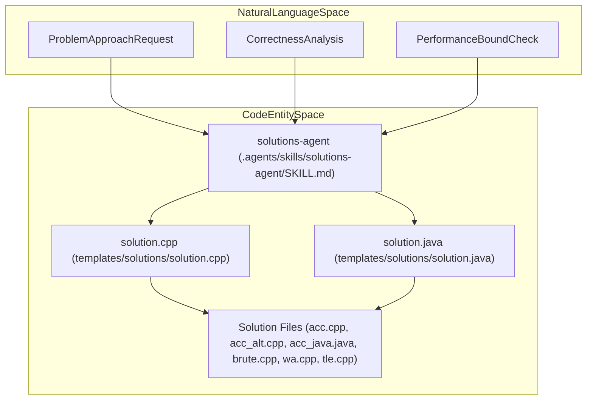

# Solutions Agent

<details>
<summary>Relevant source files</summary>

The following files were used as context for generating this wiki page:
- [.agents/skills/solutions-agent/SKILL.md](https://github.com/7oSkaaa/polygon-problems-generator/blob/main/.agents/skills/solutions-agent/SKILL.md)
- [.claude/agents/solutions-agent.md](https://github.com/7oSkaaa/polygon-problems-generator/blob/main/.claude/agents/solutions-agent.md)
- [.cursor/rules/04-solutions.mdc](https://github.com/7oSkaaa/polygon-problems-generator/blob/main/.cursor/rules/04-solutions.mdc)
- [templates/solutions/solution.cpp](https://github.com/7oSkaaa/polygon-problems-generator/blob/main/templates/solutions/solution.cpp)
- [templates/solutions/solution.java](https://github.com/7oSkaaa/polygon-problems-generator/blob/main/templates/solutions/solution.java)

</details>


The Solutions Agent is responsible for analyzing algorithmic problems and generating reference solutions across multiple languages and correctness tiers (`acc`, `acc_java`, `acc_alt`, `brute`, `wa`, `tle`). It ensures all solutions adhere strictly to standard competitive programming libraries, template contracts, and platform constraints.

Sources: [.agents/skills/solutions-agent/SKILL.md:1-50](https://github.com/7oSkaaa/polygon-problems-generator/blob/main/.agents/skills/solutions-agent/SKILL.md#L1-L50), [.cursor/rules/04-solutions.mdc:1-49](https://github.com/7oSkaaa/polygon-problems-generator/blob/main/.cursor/rules/04-solutions.mdc#L1-L49)

---

## Core Solution Categories and Tags

The Solutions Agent generates code mapped to specific roles and verification tags within the problem package:

| Solution Tag / Filename Role | Requirement & Behavioral Contract |
|-----------------------------|------------------------------------|
| `ACC` (`acc.cpp`) | 100% correct solution. Must be a clear, relaxed implementation rather than an overly micro-optimized routine. |
| `ACC Alt` (`acc_alt.cpp`) | A second independent correct C++ solution utilizing a distinctly different algorithmic approach, not merely a syntactic rewrite of `acc.cpp`. |
| `ACC Java` (`acc_java.java`) | Java equivalent of the correct solution, using `Java 21` and standard input handling. |
| `TLE` (`tle.cpp`) | Intentionally suboptimal time complexity (e.g., $O(n^2)$ or worse) designed to exceed the time limit on large test cases. |
| `WA` (`wa.cpp`) | Contains an intentional, subtle bug (such as integer overflow or off-by-one error) to produce incorrect outputs on targeted inputs. |
| `Brute Force` (`brute.cpp`) | Simple, naive $O(n^2+)$ reference solution used primarily for stress testing and test case generation checks. |

Sources: [.agents/skills/solutions-agent/SKILL.md:26-33](https://github.com/7oSkaaa/polygon-problems-generator/blob/main/.agents/skills/solutions-agent/SKILL.md#L26-L33), [.cursor/rules/04-solutions.mdc:25-32](https://github.com/7oSkaaa/polygon-problems-generator/blob/main/.cursor/rules/04-solutions.mdc#L25-L32)

---

## Solution Templates and Structural Conventions

All generated solutions must strictly build upon the provided template files. The underlying skeleton enforces modular separation via `solve()` functions and standard template headers.

### C++ Solution Base Structure
C++ solutions must target C++17, utilizing standard libraries without proprietary extensions. The entry point follows `templates/solutions/solution.cpp`:

```cpp
#include <bits/stdc++.h>
using namespace std;

void solve() {
}

int main() {
    ios::sync_with_stdio(false);
    cin.tie(nullptr);
    // Interactive: do not use sync_with_stdio(false) or cin.tie(nullptr).

    int test_cases = 1;
    // cin >> test_cases;
    while (test_cases--) {
        solve();
    }
    return 0;
}
```
Sources: [templates/solutions/solution.cpp:1-18](https://github.com/7oSkaaa/polygon-problems-generator/blob/main/templates/solutions/solution.cpp#L1-L18), [.agents/skills/solutions-agent/SKILL.md:16-16](https://github.com/7oSkaaa/polygon-problems-generator/blob/main/.agents/skills/solutions-agent/SKILL.md#L16-L16)

### Java Solution Base Structure
Java solutions target Java 21. The class name must be refactored to match the target file name (e.g., `acc_java.java` must declare `public class acc_java`), utilizing `java.util.Scanner` as defined in `templates/solutions/solution.java`:

```java
import java.util.Scanner;

public class solution {
    static Scanner in = new Scanner(System.in);

    static void solve() {
    }

    public static void main(String[] args) {
        int testCases = 1;
        // testCases = in.nextInt();
        while (testCases-- > 0) {
            solve();
        }
    }
}
```
Sources: [templates/solutions/solution.java:1-16](https://github.com/7oSkaaa/polygon-problems-generator/blob/main/templates/solutions/solution.java#L1-L16), [.agents/skills/solutions-agent/SKILL.md:17-17](https://github.com/7oSkaaa/polygon-problems-generator/blob/main/.agents/skills/solutions-agent/SKILL.md#L17-L17)

---

## Banned Constructs and Coding Constraints

To maintain portability and compatibility with the verification framework (`verify.sh`) and Polygon packaging tools, the Solutions Agent enforces strict negative constraints:

* **No `#define` macros**: Avoid preprocessor macro substitutions in C++ solutions.
* **No GCC pragmas**: Do not include `#pragma GCC optimize` or other compiler-optimization directives.
* **No `freopen`**: Never read or write files manually using `freopen` inside solutions; standard I/O streams must be used.
* **No compiler warnings**: Code must compile cleanly under `-Werror` flags.
* **Interactive constraints**: For interactive problems, C++ solutions must *not* call `ios::sync_with_stdio(false)` or `cin.tie(nullptr)`, and judge responses must be consumed using `string` streams.

Sources: [.agents/skills/solutions-agent/SKILL.md:16-24](https://github.com/7oSkaaa/polygon-problems-generator/blob/main/.agents/skills/solutions-agent/SKILL.md#L16-L24), [.cursor/rules/04-solutions.mdc:15-24](https://github.com/7oSkaaa/polygon-problems-generator/blob/main/.cursor/rules/04-solutions.mdc#L15-L24)

---

## Multi-Test vs. Single-Test Handling

Solutions must dynamically configure test case loops depending on whether the problem specifications require multi-test processing:

* **Multi-test problems**: Uncomment `cin >> test_cases;` (C++) or `testCases = in.nextInt();` (Java) within `main()`.
* **Single-test problems**: Keep `test_cases = 1` (C++) or `testCases = 1` (Java) — do *not* read test case counts from input streams.

Sources: [.agents/skills/solutions-agent/SKILL.md:34-39](https://github.com/7oSkaaa/polygon-problems-generator/blob/main/.agents/skills/solutions-agent/SKILL.md#L34-L39), [.cursor/rules/04-solutions.mdc:33-38](https://github.com/7oSkaaa/polygon-problems-generator/blob/main/.cursor/rules/04-solutions.mdc#L33-L38)

---

## Architectural Mapping: Natural Language to Code Entities

The diagram below maps abstract problem analysis requests (Natural Language Space) to specific files, functions, and configuration properties (Code Entity Space) handled by the Solutions Agent.


Sources: [.agents/skills/solutions-agent/SKILL.md:1-50](https://github.com/7oSkaaa/polygon-problems-generator/blob/main/.agents/skills/solutions-agent/SKILL.md#L1-L50), [templates/solutions/solution.cpp:1-18](https://github.com/7oSkaaa/polygon-problems-generator/blob/main/templates/solutions/solution.cpp#L1-L18), [templates/solutions/solution.java:1-16](https://github.com/7oSkaaa/polygon-problems-generator/blob/main/templates/solutions/solution.java#L1-L16)

---

## Solution Generation and Verification Workflow

The following sequence illustrates how the Solutions Agent processes template definitions and validates input formats before emitting target files.

```mermaid
graph TD
    subgraph "NaturalLanguageSpace"
        REQ["UserProblemSpecification"]
    end

    subgraph "CodeEntitySpace"
        SA["solutions-agent (.claude/agents/solutions-agent.md)"]
        SCPP["templates/solutions/solution.cpp"]
        SJAVA["templates/solutions/solution.java"]
        OUT["Generated Solutions (acc.cpp, acc_alt.cpp, acc_java.java)"]
    end

    REQ --> SA
    SA -->|Read| SCPP
    SA -->|Read| SJAVA
    SCPP -->|Base Skeleton| OUT
    SJAVA -->|Base Skeleton| OUT
    SA -->|Inject solve() logic| OUT
```
Sources: [.claude/agents/solutions-agent.md:12-48](https://github.com/7oSkaaa/polygon-problems-generator/blob/main/.claude/agents/solutions-agent.md#L12-L48), [templates/solutions/solution.cpp:1-18](https://github.com/7oSkaaa/polygon-problems-generator/blob/main/templates/solutions/solution.cpp#L1-L18), [templates/solutions/solution.java:1-16](https://github.com/7oSkaaa/polygon-problems-generator/blob/main/templates/solutions/solution.java#L1-L16)
