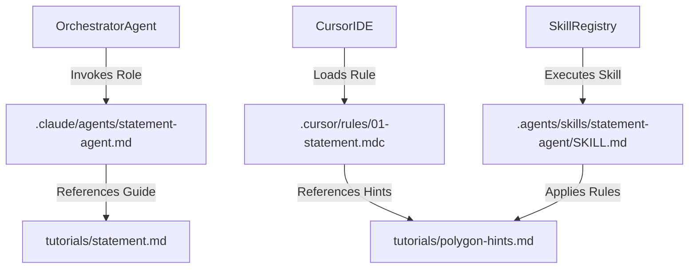
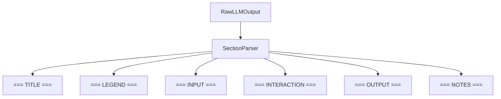

# Statement & Tutorial Agent

<details>
<summary>Relevant source files</summary>

The following files were used as context for generating this wiki page:
- [.agents/skills/statement-agent/SKILL.md](https://github.com/7oSkaaa/polygon-problems-generator/blob/main/.agents/skills/statement-agent/SKILL.md)
- [.claude/agents/statement-agent.md](https://github.com/7oSkaaa/polygon-problems-generator/blob/main/.claude/agents/statement-agent.md)
- [.cursor/rules/01-statement.mdc](https://github.com/7oSkaaa/polygon-problems-generator/blob/main/.cursor/rules/01-statement.mdc)
- [tutorials/polygon-hints.md](https://github.com/7oSkaaa/polygon-problems-generator/blob/main/tutorials/polygon-hints.md)
- [tutorials/statement.md](https://github.com/7oSkaaa/polygon-problems-generator/blob/main/tutorials/statement.md)

</details>


## Purpose and Scope

The Statement & Tutorial Agent is a specialized sub-agent within the agent framework responsible for generating and refining competitive programming problem statements and tutorials (editorials) that are fully compatible with the Codeforces Polygon platform. This page details the implementation rules, prose guidelines, LaTeX formatting constraints, structural section headers, and the technique for masking core algorithmic insights in generated problem statements.

Sources:
- [.agents/skills/statement-agent/SKILL.md:1-4](https://github.com/7oSkaaa/polygon-problems-generator/blob/main/.agents/skills/statement-agent/SKILL.md#L1-L4), [.claude/agents/statement-agent.md:1-8](https://github.com/7oSkaaa/polygon-problems-generator/blob/main/.claude/agents/statement-agent.md#L1-L8)

---

## Agent Configuration & Rules Architecture

The Statement & Tutorial Agent is defined across multiple configuration artifacts and skill definitions in the repository. These files enforce unified behavior across different LLM backends and orchestration workflows (such as Claude agents, Cursor rules, and general skill directories). 

The following diagram maps the natural language space and role expectations to the underlying code entities and rule files in the repository:



### Configuration Source Files
- **Claude Agent Def:** [.claude/agents/statement-agent.md:1-167](https://github.com/7oSkaaa/polygon-problems-generator/blob/main/.claude/agents/statement-agent.md#L1-L167) defines the tool bindings and prompt instructions for the Claude environment.
- **Cursor Rule Def:** [.cursor/rules/01-statement.mdc:1-161](https://github.com/7oSkaaa/polygon-problems-generator/blob/main/.cursor/rules/01-statement.mdc#L1-L161) provides workspace-specific rule injection triggered by file glob patterns (`**/statement*.tex`, `**/tutorial*.tex`, `**/raw.tex`).
- **Skill Definition:** [.agents/skills/statement-agent/SKILL.md:1-167Coins]() registers the skill configuration package consumed by multi-tool synchronization scripts.

Sources:
- [.agents/skills/statement-agent/SKILL.md:1-162](https://github.com/7oSkaaa/polygon-problems-generator/blob/main/.agents/skills/statement-agent/SKILL.md#L1-L162), [.cursor/rules/01-statement.mdc:1-161](https://github.com/7oSkaaa/polygon-problems-generator/blob/main/.cursor/rules/01-statement.mdc#L1-L161), [.claude/agents/statement-agent.md:1-167](https://github.com/7oSkaaa/polygon-problems-generator/blob/main/.claude/agents/statement-agent.md#L1-L167)

---

## Hiding the Main Idea

A core requirement for any competitive programming problem statement is that it must describe **what** to compute rather than **how** to compute it. The statement-writing rules explicitly prohibit naming or hinting at underlying algorithms, data structures, or optimization techniques.

### Rules for Concealing Solution Mechanics
- **No Technical Keywords:** Never mention terms such as "shortest path", "binary search", "segment tree", "greedy", "dynamic programming", "maximum flow", or "minimum spanning tree" [.agents/skills/statement-agent/SKILL.md:18-20](https://github.com/7oSkaaa/polygon-problems-generator/blob/main/.agents/skills/statement-agent/SKILL.md#L18-L20).
- **Task Framing:** Frame everything strictly in terms of the domain task, input parameters, and expected objective (e.g., if the core reduction is an MST, describe the task as connecting locations at minimum cost rather than building graphs or trees) [.agents/skills/statement-agent/SKILL.md:21-22](https://github.com/7oSkaaa/polygon-problems-generator/blob/main/.agents/skills/statement-agent/SKILL.md#L21-L22).
- **Evaluation Metric:** A solver who does not yet know the solution must not be able to deduce the required algorithm solely by reading the problem description [.agents/skills/statement-agent/SKILL.md:23-23](https://github.com/7oSkaaa/polygon-problems-generator/blob/main/.agents/skills/statement-agent/SKILL.md#L23-L23).

Sources:
- [.agents/skills/statement-agent/SKILL.md:16-24](https://github.com/7oSkaaa/polygon-problems-generator/blob/main/.agents/skills/statement-agent/SKILL.md#L16-L24)

---

## TeX & Polygon Formatting Guidelines

Statements and tutorials must be written in raw LaTeX content without any `\begin{document}` wrapper [.agents/skills/statement-agent/SKILL.md:30-30](https://github.com/7oSkaaa/polygon-problems-generator/blob/main/.agents/skills/statement-agent/SKILL.md#L30-L30). Polygon renders these snippets directly using MathJax and standard TeX engines.



### LaTeX Formatting Rules
- **Math Mode Variables:** All variables and parameters must be wrapped in math mode: `$n$`, `$a_i$`, `$1 \leq i \leq n$` [.agents/skills/statement-agent/SKILL.md:26-26](https://github.com/7oSkaaa/polygon-problems-generator/blob/main/.agents/skills/statement-agent/SKILL.md#L26-L26).
- **Inequalities:** Always use explicit TeX relational commands: `\leq`, `\geq`, `\neq` — never use `<=`, `>=`, or `!=` [.agents/skills/statement-agent/SKILL.md:27-27](https://github.com/7oSkaaa/polygon-problems-generator/blob/main/.agents/skills/statement-agent/SKILL.md#L27-L27).
- **Multiplication:** Use `\times` for multiplication; never use `\cdot`, `\cdots`, or literal `x` [.agents/skills/statement-agent/SKILL.md:28-28](https://github.com/7oSkaaa/polygon-problems-generator/blob/main/.agents/skills/statement-agent/SKILL.md#L28-L28).
- **Sequences:** Use `\ldots` for sequences such as `$a_1, a_2, \ldots, a_n$` [.agents/skills/statement-agent/SKILL.md:29-29](https://github.com/7oSkaaa/polygon-problems-generator/blob/main/.agents/skills/statement-agent/SKILL.md#L29-L29).
- **Typography:** Use `\texttt{...}` for code or file names, `\textbf{...}` for bold emphasis, and `lstlisting` environments for multi-line code snippets in tutorials [.agents/skills/statement-agent/SKILL.md:31-34](https://github.com/7oSkaaa/polygon-problems-generator/blob/main/.agents/skills/statement-agent/SKILL.md#L31-L34).

Sources:
- [.agents/skills/statement-agent/SKILL.md:25-34](https://github.com/7oSkaaa/polygon-problems-generator/blob/main/.agents/skills/statement-agent/SKILL.md#L25-L34), [tutorials/statement.md:78-150](https://github.com/7oSkaaa/polygon-problems-generator/blob/main/tutorials/statement.md#L78-L150)

---

## Humanizer Style & Prose Constraints

To prevent statements and tutorials from sounding like generic AI outputs, prose must adhere to a "humanizer" style guide that emphasizes directness and clarity [tutorials/statement.md:23-25](https://github.com/7oSkaaa/polygon-problems-generator/blob/main/tutorials/statement.md#L23-L25).

### Prose Guidelines
- **Simple English:** Prefer short sentences of mixed length. Avoid uniform sentence structures [.agents/skills/statement-agent/SKILL.md:38-51](https://github.com/7oSkaaa/polygon-problems-generator/blob/main/.agents/skills/statement-agent/SKILL.md#L38-L51).
- **Active Verbs:** Use straightforward linking verbs (`is`, `are`, `has`). Avoid bloated phrasing like `serves as`, `stands as`, `marks a`, or `boasts` [.agents/skills/statement-agent/SKILL.md:52-53](https://github.com/7oSkaaa/polygon-problems-generator/blob/main/.agents/skills/statement-agent/SKILL.md#L52-L53).
- **Banned AI Vocabulary:** Prohibited terms include `pivotal`, `testament`, `underscores`, `vibrant`, `delve`, `landscape`, `at its core`, `Additionally`, `Moreover`, `It is important to note`, and `Let's dive in` [.agents/skills/statement-agent/SKILL.md:57-60](https://github.com/7oSkaaa/polygon-problems-generator/blob/main/.agents/skills/statement-agent/SKILL.md#L57-L60).
- **Structure:** End legends directly on the task requirements rather than with vague motivational remarks or filler text [.agents/skills/statement-agent/SKILL.md:61-61](https://github.com/7oSkaaa/polygon-problems-generator/blob/main/.agents/skills/statement-agent/SKILL.md#L61-L61).

Sources:
- [.agents/skills/statement-agent/SKILL.md:37-70](https://github.com/7oSkaaa/polygon-problems-generator/blob/main/.agents/skills/statement-agent/SKILL.md#L37-L70), [tutorials/polygon-hints.md:34-43](https://github.com/7oSkaaa/polygon-problems-generator/blob/main/tutorials/polygon-hints.md#L34-L43)

---

## Statement and Tutorial Output Formats

The agent outputs files structured around strict section dividers. Non-interactive statements include Title, Legend, Input, Output, and Notes. Interactive statements include a dedicated Interaction section and sample interaction tables [tutorials/statement.md:9-20](https://github.com/7oSkaaa/polygon-problems-generator/blob/main/tutorials/statement.md#L9-L20).

### Standard Statement Section Structure
```
=== TITLE ===
\textbf{\Large <Problem Title>}

=== LEGEND ===
<TeX — 2-4 short sentences stating the task>

=== INPUT ===
<TeX for the input section, constraints, and test case format>

=== OUTPUT ===
<TeX for the output section>

=== NOTES ===
<TeX explaining sample test cases and edge cases>
```

### Interactive Problem Additions
For interactive problems, `=== INTERACTION ===` is inserted between Input and Output, detailing the round-by-round query/response protocol, flush instructions (`cout << endl`, `fflush(stdout)`, `System.out.flush()`, `sys.stdout.flush()`), and error handling (`-1` protocol) [.agents/skills/statement-agent/SKILL.md:94-128](https://github.com/7oSkaaa/polygon-problems-generator/blob/main/.agents/skills/statement-agent/SKILL.md#L94-L128). Additionally, a sample interaction table is included under `=== NOTES ===` using a tabular environment [.agents/skills/statement-agent/SKILL.md:133-146](https://github.com/7oSkaaa/polygon-problems-generator/blob/main/.agents/skills/statement-agent/SKILL.md#L133-L146).

### Tutorial Output Format
```
=== KEY OBSERVATIONS ===
<TeX — 2-4 bullet points covering core insights>

=== SOLUTION ===
<TeX — step-by-step algorithmic breakdown>

=== COMPLEXITY ===
<TeX — time and space complexity analysis>

=== NOTES ===
<TeX — edge cases or alternative solutions>
```

Sources:
- [.agents/skills/statement-agent/SKILL.md:80-162](https://github.com/7oSkaaa/polygon-problems-generator/blob/main/.agents/skills/statement-agent/SKILL.md#L80-L162), [tutorials/statement.md:9-20](https://github.com/7oSkaaa/polygon-problems-generator/blob/main/tutorials/statement.md#L9-L20)
