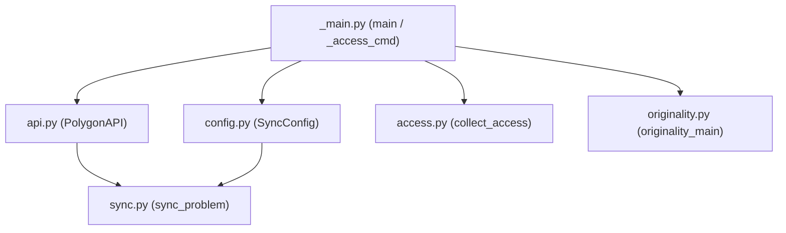

# polyup: Build & Upload Toolchain

Relevant source files

The following files were used as context for generating this wiki page:
- [polyup/__init__.py](https://github.com/7oSkaaa/polygon-problems-generator/blob/main/polyup/__init__.py)
- [polyup/__main__.py](https://github.com/7oSkaaa/polygon-problems-generator/blob/main/polyup/__main__.py)

## Purpose and Scope
The `polyup` package is a Python-based toolchain responsible for packaging local problem directories (`problems/<name>/`) and synchronizing them with the Polygon platform via its API. It automates problem building, verification, statement parsing, access control management, and pre-upload originality gating. 

This page provides a high-level architectural overview of the `polyup` package. For detailed technical information, refer to the child pages:
- [CLI and Configuration](https://github.com/7oSkaaa/polygon-problems-generator/blob/main/CLI-and-Configuration)
- [Polygon API Client & Sync](https://github.com/7oSkaaa/polygon-problems-generator/blob/main/Polygon-API-Client-and-Sync)
- [Access Control & Originality Check](https://github.com/7oSkaaa/polygon-problems-generator/blob/main/Access-Control-and-Originality-Check)

Sources: [polyup/__main__.py:1-145](https://github.com/7oSkaaa/polygon-problems-generator/blob/main/polyup/__main__.py#L1-L145), [polyup/__init__.py:1-7](https://github.com/7oSkaaa/polygon-problems-generator/blob/main/polyup/__init__.py#L1-L7)

---

## 4.1 CLI and Configuration
The CLI entry point is defined in `polyup/__main__.py`, which parses command-line arguments using `argparse` and initializes configuration profiles. It supports primary sync operations, access management subcommands, and originality checks [polyup/__main__.py:1-145](https://github.com/7oSkaaa/polygon-problems-generator/blob/main/polyup/__main__.py#L1-L145). Environment variables such as `POLYGON_API_KEY` and `POLYGON_API_SECRET` are loaded locally via `.env` file parsing [polyup/__main__.py:15-32](https://github.com/7oSkaaa/polygon-problems-generator/blob/main/polyup/__main__.py#L15-L32).

For detailed flags, environment variable loading rules, and configuration dataclasses, see [CLI and Configuration](CLI-and-Configuration).

Sources: [polyup/__main__.py:1-145](https://github.com/7oSkaaa/polygon-problems-generator/blob/main/polyup/__main__.py#L1-L145)

---

## 4.2 Polygon API Client & Sync
Interactions with the remote Polygon service are managed by `PolygonAPI` in `api.py`, which handles request construction and signature generation. The synchronization workflow (`sync.py`) coordinates mapping local files (statements, solutions, generators, validators, checkers) to remote Polygon problem entities, managing test sets, building packages, and executing verification runs. Statement parsing (`parsers.py`) converts LaTeX components into structured Polygon metadata.

For detailed request signing mechanics, statement parsers, and synchronization flow steps, see [Polygon API Client & Sync](Polygon-API-Client-and-Sync).

Sources: [polyup/__init__.py:1-7](https://github.com/7oSkaaa/polygon-problems-generator/blob/main/polyup/__init__.py#L1-L7), [polyup/__main__.py:10-12](https://github.com/7oSkaaa/polygon-problems-generator/blob/main/polyup/__main__.py#L10-L12)

---

## 4.3 Access Control & Originality Check
Security and administrative controls are split into user permission management and code originality gating. The `access.py` module handles direct user access merging and invokes `problem.setAccess` routines [polyup/__main__.py:56-87](https://github.com/7oSkaaa/polygon-problems-generator/blob/main/polyup/__main__.py#L56-L87). Concurrently, `originality.py` acts as a similarity gate against known problem sources (`yuantiji`) before publication.

For details on permission mapping levels (`READ`, `WRITE`, `NONE`) and the similarity checking script, see [Access Control & Originality Check](Access-Control-and-Originality-Check).

Sources: [polyup/__main__.py:9-12](https://github.com/7oSkaaa/polygon-problems-generator/blob/main/polyup/__main__.py#L9-L12), [polyup/__main__.py:56-96](https://github.com/7oSkaaa/polygon-problems-generator/blob/main/polyup/__main__.py#L56-L96)
