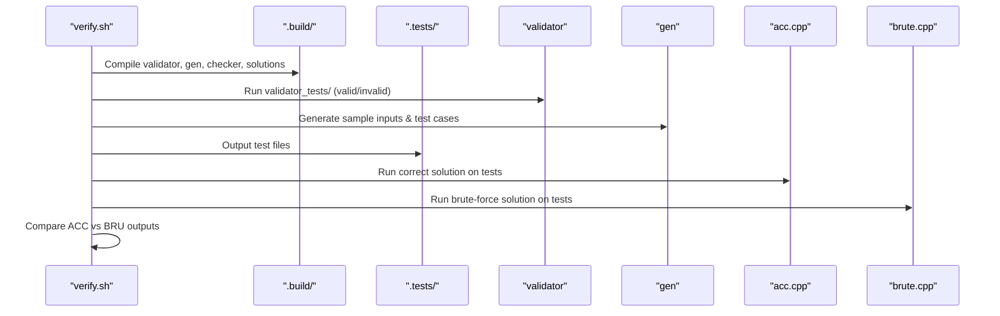

# verify.sh Harness

<details>
<summary>Relevant source files</summary>

The following files were used as context for generating this wiki page:
- [docs/verify.md](https://github.com/7oSkaaa/polygon-problems-generator/blob/main/docs/verify.md)
- [verify.sh](https://github.com/7oSkaaa/polygon-problems-generator/blob/main/verify.sh)

</details>


The `verify.sh` script functions as the local pre-upload verification harness for problem directories (`[[verify.sh:4-11](https://github.com/7oSkaaa/polygon-problems-generator/blob/main/verify.sh#L4-L11)]`, `[[docs/verify.md:1-3](https://github.com/7oSkaaa/polygon-problems-generator/blob/main/docs/verify.md#L1-L3)]`). It provides a fast local sanity check to ensure code compiles cleanly with strict flags, validation logic functions correctly, samples match, cross-language solutions behave identically, and stress tests pass before a problem is packaged and uploaded via `polyup` (`[[verify.sh:13-20](https://github.com/7oSkaaa/polygon-problems-generator/blob/main/verify.sh#L13-L20)]`, `[[docs/verify.md:3-34](https://github.com/7oSkaaa/polygon-problems-generator/blob/main/docs/verify.md#L3-L34)]`).

---

## Script Architecture and CLI Options

The harness parses command-line flags to control execution scope, stress test iterations, cleanup behavior, and third-party checks (`[[verify.sh:33-62](https://github.com/7oSkaaa/polygon-problems-generator/blob/main/verify.sh#L33-L62)]`, `[[docs/verify.md:9-15](https://github.com/7oSkaaa/polygon-problems-generator/blob/main/docs/verify.md#L9-L15)]`).

| Flag | Meaning | Source Reference |
|---|---|---|
| `--stress N` | ACC vs brute iterations (default `1000`) | `[[verify.sh:39](https://github.com/7oSkaaa/polygon-problems-generator/blob/main/verify.sh#L39)]`, `[[docs/verify.md:11](https://github.com/7oSkaaa/polygon-problems-generator/blob/main/docs/verify.md#L11)]` |
| `--keep` | Preserve `.build` and `.tests` directories after completion | `[[verify.sh:40](https://github.com/7oSkaaa/polygon-problems-generator/blob/main/verify.sh#L40)]`, `[[docs/verify.md:12](https://github.com/7oSkaaa/polygon-problems-generator/blob/main/docs/verify.md#L12)]` |
| `--skip-originality` | Bypass the `yuantiji.ac` originality check | `[[verify.sh:41](https://github.com/7oSkaaa/polygon-problems-generator/blob/main/verify.sh#L41)]`, `[[docs/verify.md:13](https://github.com/7oSkaaa/polygon-problems-generator/blob/main/docs/verify.md#L13)]` |
| `--skip-stress` | Bypass the ACC vs. brute stress testing stage | `[[verify.sh:42](https://github.com/7oSkaaa/polygon-problems-generator/blob/main/verify.sh#L42)]`, `[[docs/verify.md:14](https://github.com/7oSkaaa/polygon-problems-generator/blob/main/docs/verify.md#L14)]` |
| `-h`, `--help` | Display usage instructions and exit | `[[verify.sh:33-36](https://github.com/7oSkaaa/polygon-problems-generator/blob/main/verify.sh#L33-L36)]` |

The script loads the Java environment using `scripts/java-env.sh` (`[[verify.sh:73-74](https://github.com/7oSkaaa/polygon-problems-generator/blob/main/verify.sh#L73-L74)]`), locates `testlib/testlib.h` (`[[verify.sh:75](https://github.com/7oSkaaa/polygon-problems-generator/blob/main/verify.sh#L75)]`), and configures strict C++ compiler flags (`[[verify.sh:78](https://github.com/7oSkaaa/polygon-problems-generator/blob/main/verify.sh#L78)]`):

```bash
CXXFLAGS="-std=c++17 -O2 -Wall -Wextra -Werror -I$(dirname "$TESTLIB") -I$HOME/.local/include"
```

Execution timeouts are managed via `gtimeout` or GNU `timeout` if available, falling back to direct execution otherwise (`[[verify.sh:85-91](https://github.com/7oSkaaa/polygon-problems-generator/blob/main/verify.sh#L85-L91)]`). An `EXIT` trap ensures temporary build artifacts are cleaned up unless `--keep` is specified (`[[verify.sh:93-100](https://github.com/7oSkaaa/polygon-problems-generator/blob/main/verify.sh#L93-L100)]`).

Sources: `[[verify.sh:33-100](https://github.com/7oSkaaa/polygon-problems-generator/blob/main/verify.sh#L33-L100)]`, `[[docs/verify.md:1-15](https://github.com/7oSkaaa/polygon-problems-generator/blob/main/docs/verify.md#L1-L15)]`

---

## Verification Pipeline Stages

The verification process executes a sequence of checks from static analysis up to stress testing (`[[verify.sh:13-20](https://github.com/7oSkaaa/polygon-problems-generator/blob/main/verify.sh#L13-L20)]`, `[[docs/verify.md:16-27](https://github.com/7oSkaaa/polygon-problems-generator/blob/main/docs/verify.md#L16-L27)]`):

```mermaid
graph TD
    A["verify.sh"] --> B["Static Checks"]
    B --> C["Originality Search"]
    C --> D["Checker Compilation"]
    D --> E["Validator & Generator Compilation"]
    E --> F["Unique Tests Check"]

    sub: "Code Entities"
    B -.->|"grep #pragma"| B1["solutions/*.cpp, validator.cpp"]
    C -.->|"polyup originality"| C1["yuantiji.ac API"]
    D -.->|"g++ CXXFLAGS"| D1["checker.cpp / standard checker"]
    E -.->|"g++ CXXFLAGS"| E1["validator.cpp, generator.cpp"]
    F -.->|"check-gen-uniques.py"| F1["samples/ & gen output"]
```

Sources: `[[verify.sh:112-207](https://github.com/7oSkaaa/polygon-problems-generator/blob/main/verify.sh#L112-L207)]`, `[[docs/verify.md:16-21](https://github.com/7oSkaaa/polygon-problems-generator/blob/main/docs/verify.md#L16-L21)]`

### 1. Static Checks
The script scans all solution sources, `validator.cpp`, `checker.cpp`, and `interactor.cpp` for unauthorized compiler optimization pragmas (`#pragma GCC optimize` or `#pragma clang optimize`), failing immediately if detected (`[[verify.sh:114-130](https://github.com/7oSkaaa/polygon-problems-generator/blob/main/verify.sh#L114-L130)]`). It also enforces strict naming rules restricting source file names to alphanumeric characters, periods, and underscores (`[[verify.sh:125-128](https://github.com/7oSkaaa/polygon-problems-generator/blob/main/verify.sh#L125-L128)]`).

### 2. Originality Search
Unless `--skip-originality` is passed, `verify.sh` invokes `python3 -m polyup originality` to query the `yuantiji.ac` similarity service (`[[verify.sh:135-150](https://github.com/7oSkaaa/polygon-problems-generator/blob/main/verify.sh#L135-L150)]`, `[[docs/verify.md:13](https://github.com/7oSkaaa/polygon-problems-generator/blob/main/docs/verify.md#L13)]`). High similarity blocks the verification pipeline unless the problem is tagged as Ace or Div2-A (`[[verify.sh:141-145](https://github.com/7oSkaaa/polygon-problems-generator/blob/main/verify.sh#L141-L145)]`).

### 3. Checker & Validator Resolution
- **Checker**: If `checker.cpp` begins with `// Use standard checker: <name>`, the harness pulls the corresponding source from `testlib/checkers/<name>.cpp` (`[[verify.sh:160-166](https://github.com/7oSkaaa/polygon-problems-generator/blob/main/verify.sh#L160-L166)]`). Otherwise, it compiles the custom `checker.cpp` with `-Werror` (`[[verify.sh:171-176](https://github.com/7oSkaaa/polygon-problems-generator/blob/main/verify.sh#L171-L176)]`).
- **Validator**: Compiles `validator.cpp` into `$BUILD/validator` using `$CXXFLAGS` (`[[verify.sh:186-192](https://github.com/7oSkaaa/polygon-problems-generator/blob/main/verify.sh#L186-L192)]`).
- **Generator**: Compiles `generator.cpp` into `$BUILD/gen` and executes `scripts/check-gen-uniques.py` to ensure generated test cases do not duplicate each other or the sample files (`[[verify.sh:197-207](https://github.com/7oSkaaa/polygon-problems-generator/blob/main/verify.sh#L197-L207)]`).

Sources: `[[verify.sh:112-207](https://github.com/7oSkaaa/polygon-problems-generator/blob/main/verify.sh#L112-L207)]`, `[[docs/verify.md:16-21](https://github.com/7oSkaaa/polygon-problems-generator/blob/main/docs/verify.md#L16-L21)]`

---

## Execution Flow and Data Flow

Data flows through isolated temporary build (`.build`) and test (`.tests`) subdirectories inside the problem folder (`[[verify.sh:79-80](https://github.com/7oSkaaa/polygon-problems-generator/blob/main/verify.sh#L79-L80)]`, `[[verify.sh:102](https://github.com/7oSkaaa/polygon-problems-generator/blob/main/verify.sh#L102)]`):



Sources: `[[verify.sh:79-102](https://github.com/7oSkaaa/polygon-problems-generator/blob/main/verify.sh#L79-L102)]`, `[[docs/verify.md:16-37](https://github.com/7oSkaaa/polygon-problems-generator/blob/main/docs/verify.md#L16-L37)]`

---

## Error Handling, Timeouts, and Limitations

- **Strict Compilation**: All C++ components (`validator.cpp`, `checker.cpp`, `interactor.cpp`, solutions, generators) are compiled with `-Wall -Wextra -Werror`, ensuring zero warnings are tolerated (`[[verify.sh:16-18](https://github.com/7oSkaaa/polygon-problems-generator/blob/main/verify.sh#L16-L18)]`, `[[docs/verify.md:20](https://github.com/7oSkaaa/polygon-problems-generator/blob/main/docs/verify.md#L20)]`).
- **Interactive Problems**: If an `interactor.cpp` file is present in the problem directory, the harness flags the problem as interactive (`[[verify.sh:82-83](https://github.com/7oSkaaa/polygon-problems-generator/blob/main/verify.sh#L82-L83)]`, `[[verify.sh:108-110](https://github.com/7oSkaaa/polygon-problems-generator/blob/main/verify.sh#L108-L110)]`), skipping conventional checker-vs-WA and ACC-vs-brute comparisons where appropriate (`[[docs/verify.md:36](https://github.com/7oSkaaa/polygon-problems-generator/blob/main/docs/verify.md#L36)]`).
- **Polyman Distinction**: `verify.sh` acts as a fast local pre-upload verification net and does not replicate full Polygon package building or FreeMarker script interpretation performed by Polyman or the official Polygon platform (`[[docs/verify.md:3-4](https://github.com/7oSkaaa/polygon-problems-generator/blob/main/docs/verify.md#L3-L4)]`, `[[docs/verify.md:38-41](https://github.com/7oSkaaa/polygon-problems-generator/blob/main/docs/verify.md#L38-L41)]`).

Sources: `[[verify.sh:16-18](https://github.com/7oSkaaa/polygon-problems-generator/blob/main/verify.sh#L16-L18)]`, `[[verify.sh:82-110](https://github.com/7oSkaaa/polygon-problems-generator/blob/main/verify.sh#L82-L110)]`, `[[docs/verify.md:3-41](https://github.com/7oSkaaa/polygon-problems-generator/blob/main/docs/verify.md#L3-L41)]`
